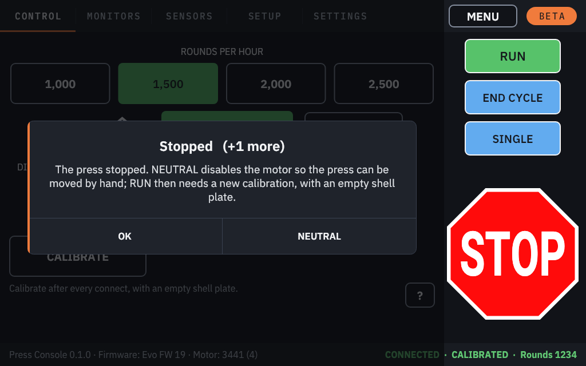
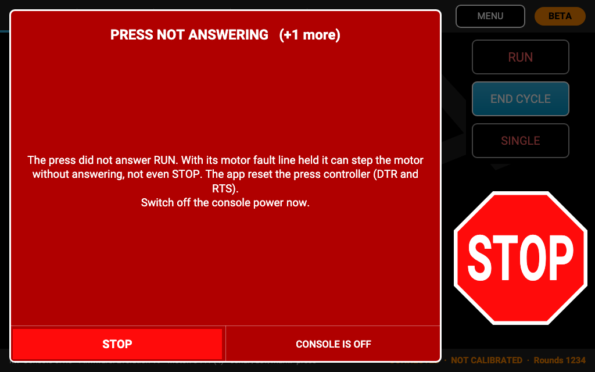

# Alerts

Everything the press reports, and every problem the console sees, becomes an alert. Alerts start once you have tapped
ACCEPT (or CONNECT).

## How alerts appear

- One alert is shown at a time. **CRITICAL** alerts always come first, then the press's own stops, then the rest;
  within each, the newest first.
- An alert is a dialog over the left part of the screen. It **never covers the RUN, END CYCLE, SINGLE and STOP
  column**, except a CRITICAL alert, which covers everything but **STOP**.
- With sound on, each new alert plays a short sound by its kind, and a CRITICAL alert sounds an alarm every few
  seconds until it is closed ([Sound](console-settings.md#sound)).
- When a run starts, any NEUTRAL or CLEAR CASE offer still open is dropped, so it can never be sent to a moving press.

## Kinds of alert

| Kind | Looks like | Examples | What to do |
|---|---|---|---|
| **Information** | a dialog | Run ended, Stopping at end of cycle, Not now | Read it, tap **OK** |
| **Warning** | a dialog | Calibration failed, Refused by the press, Connection reset, Primers low, Neutral | Read it, fix the cause, tap **OK** |
| **Stop** | a dialog | Stopped, Jam: Digital Clutch, Machine Guard open, Remote Stop, the sensor stops | The press has stopped. Make it safe, clear the cause, check for a double charge where the alert says so |
| **CRITICAL** | full screen, red | STOP NOT CONFIRMED, PRESS NOT ANSWERING, PRESS KEPT MOVING, TOUCHSCREEN NOT WORKING | **Switch off the press console's power now** |

## Stop alerts

| Alert | What happened | Buttons |
|---|---|---|
| **Stopped** | The press stopped, for example after STOP. | **OK**, **NEUTRAL** |
| **Jam: Digital Clutch** | The torque limit was reached. Clear the jam, then do the double-charge check the alert names. | **OK**, **NEUTRAL** |
| **Index torque (TorqueSense™)** | Resistance while the shell plate indexed. Clear it, then do the double-charge check. | **OK**, **NEUTRAL** |
| **Swage sensor (SwageSense™)** | Swage fault. **CLEAR CASE** raises the tool head to release the case; do the double-charge check. | **OK**, **CLEAR CASE** |
| **Machine Guard open** (**Safety Shield open** on a 1050/1100) | The guard was opened. The alert says which moves still work with it open. | **OK** |
| **Remote Stop** | The remote stop was pressed. | **OK** |
| **Decap sensor (DecapSense™)** | The spent primer was not seen ejecting. | **OK** |
| **Decap sensor dirty** | The decap sensor's beam was blocked at home. Clean it; if it was unplugged, plug it back in or bypass it. | **OK** |
| **Bullet sensor (BulletSense™)** | No projectile was detected. | **OK** |
| **Primer Orientation** | Case not present or primer not seated properly. | **OK** |
| **Index** | The shell plate did not index correctly. | **OK** |
| **Powder check** | Powder charge out of range. | **OK** |
| **Powder check 2** | The second powder check tripped. | **OK** |
| **Sensor malfunction** | A powder-check sensor is obstructed or disconnected. Bypass it if it is not fitted. | **OK** |

- **NEUTRAL** switches the motor off so the press can be moved by hand. RUN then needs a new calibration, with an
  empty shell plate ([NEUTRAL](calibrate-and-run.md#neutral)).
- **CLEAR CASE** moves the press, **even with the guard open**.
- **OK** closes the alert.

## After a jam: check for a double charge

After a **Jam**, **Index torque** or **Swage sensor** stop, a case can be left half-way through a station, and running
on can give a round **a double charge or no charge**. The alert says what to check on your press:

| Press | What the alert asks |
|---|---|
| Evo models | Check station #5 for powder in the case and empty it. |
| Revo models | Clear the case entering the shell plate and check the powder station. |
| 1050/1100 | Check station #5 (powder) and empty the case there. If the plate over- or under-indexed, power off, clear the press by hand and discard the affected rounds. |
| 650/750 | Do not just JOG and RUN. Power off, clear the press by hand and discard the affected rounds, then run one cycle at the lowest speed and clutch. |

Do it before you continue. When in doubt, switch the press off, clear it by hand and discard the affected rounds.

## Warnings and information

| Alert | What it means |
|---|---|
| **Calibration failed** | The press refused or aborted the calibration (the guard open, busy, or blocked). RUN stays locked. |
| **Refused by the press** | The press refused a command (busy, not at home, or the guard open). |
| **Not delivered** | A command did not reach the press because the connection reset. |
| **Connection reset** | The press restarted, stopped answering for 8 seconds, or the USB connection failed. Calibrate again once it reconnects ([When the connection resets](calibrate-and-run.md#when-the-connection-resets)). |
| **Primers low** | The primer sensor tripped: the run ends at the end of this cycle. Refill the primer tube. |
| **Neutral** | The motor is off. RUN stays locked until you calibrate again. |
| **Press** | A message from the press itself, shown as it is. |
| **Run ended** | The press finished the cycle and is at home. |
| **Stopping at end of cycle** | A counter on the Monitors tab reached its stop level. |
| **Firmware available** | A newer KHC firmware is available for this press ([Press firmware](firmware.md#firmware-available)). |
| **Not now** | What you tapped cannot be done at the moment; the alert says why ([below](#not-now)). |

## CRITICAL alerts

A CRITICAL alert means the console cannot be sure the press is under control.

1. **Switch off the press console's power now.** Every CRITICAL alert ends with "Switch off the console power now."
   STOP stays tappable on the alert.
2. Tap **CONSOLE IS OFF** to close the alert.
3. The console then asks **Save the logs?**: tap **SAVE LOGS** to keep them for a bug report
   ([Reporting a problem](troubleshooting.md#reporting-a-problem)), or **OK**.
4. Check the press before you switch it on again and reconnect.

| Alert | What happened |
|---|---|
| **STOP NOT CONFIRMED** | The press did not confirm a STOP within about a second, or the STOP could not reach the press at all. The console reset the press controller through the USB cable; the alert says whether that reset went out. |
| **PRESS NOT ANSWERING** | The press did not answer RUN, SINGLE CYCLE or END CYCLE within about a second. With its motor fault line held, the press can step the motor without answering anything, not even STOP or the Remote Stop. The console reset the press controller. |
| **PRESS KEPT MOVING** | The press moved after it reported a stop. The console sent STOP, and resets the press controller if that STOP is not confirmed. |
| **TOUCHSCREEN NOT WORKING** | The touch screen stopped responding, so STOP on the screen cannot work. Use the remote stop, or switch off the press console's power if the press is moving. This alert closes with **OK**, and by itself when the touch screen is back. |

### Why switch the power off

The Mark 7 press console has **no separate emergency-stop button**: its power switch is the only hard stop. The
console's controller reset normally stops the motor, but when the press has stopped answering, only the power switch
is certain.

## Not now

If you tap something the press cannot do at that moment (RUN before calibrating, CALIBRATE while running, a setting
while the press calibrates), the console shows **Not now** with the reason and sends nothing. A move that had to wait
more than a second behind something slower is also dropped with **Not now**, rather than moving the press late. A
refused foot pedal press shows **Not now (pedal)** ([Foot pedal](foot-pedal.md)).
