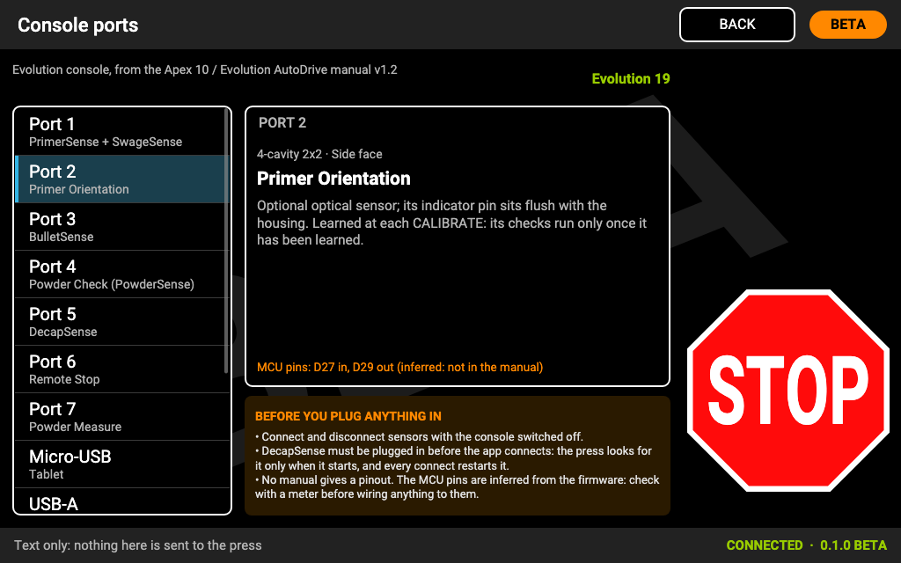
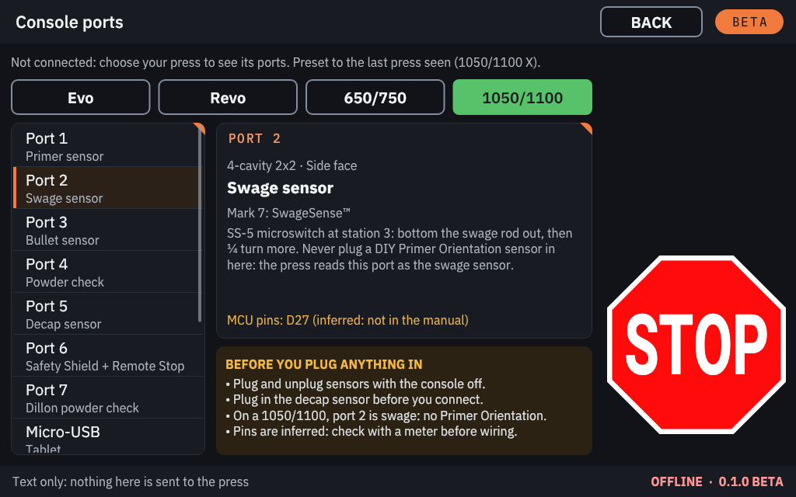

# Console ports

The Mark 7 press console has seven sensor ports (4-cavity 2x2 connectors), a micro-USB port for the console (the
Raspberry Pi), a USB-A port and an 8-pin connector for the ClearPath motor, and the power connectors. Which sensor goes
into which port depends on the press. The tables below come from Mark 7's manuals.

## The CONSOLE PORTS screen

The console shows the same information on screen. It only shows text: nothing is sent to the press.

1. Open **CONSOLE SETTINGS → CONSOLE PORTS**, or **CONSOLE PORTS** on the press screen's **Settings** tab.
2. With a press connected, the screen shows that press's console. Before connecting, pick a press family first (the
   last press seen is preselected).
3. Tap a connector in the list on the left to see its details on the right. The **BEFORE YOU PLUG ANYTHING IN** box
   sums up the rules below.

| | |
|---|---|
|  |  |

The **Sensors** tab shows the same port number on each sensor's button. The console names each sensor plainly; where
Mark 7 sells it under its own name, that name is shown beside it (for example BulletSense™). On screen the micro-USB
port's device is called "Tablet": with KHC Press Console that is the Raspberry Pi.

## Before you plug anything in

> [!WARNING]
> - **Plug and unplug sensors with the press console switched off.**
> - **Plug in the decap sensor (DecapSense™) before the console connects:** the press looks for it only when it
>   starts, and every connection restarts it.
> - **On a 1050/1100, port 2 is the swage sensor:** never connect a DIY Primer Orientation sensor there.
> - No manual gives a pinout of the ports (the pins the screen shows are inferred). Do not wire anything of your own
>   to them without checking with a meter.
> - **Never plug anything into the USB-A port except the ClearPath motor's cable.**

## Evo (Mark 7 Apex 10 Evolution)

From Mark 7's Apex 10 / Evolution AutoDrive manual.

| Port | Sensor | Note |
|---|---|---|
| 1 | Primer sensor + swage sensor (PrimerSense™ + SwageSense™) | The swage sensor plugs into a pigtail off the primer sensor's cable. Remove the primer sensor's battery when it is connected. |
| 2 | Primer Orientation | Optional. Learned at each CALIBRATE: its checks run only once it has been learned. |
| 3 | Bullet sensor (BulletSense™) | Laser sensor, powered by the console. |
| 4 | Powder check (PowderCheck™) | Optical powder check (the manual's PowderSense). |
| 5 | Decap sensor (DecapSense™) | Optical spent-primer sensor. Plug it in before the console connects. |
| 6 | Remote Stop | Wired remote stop, optional. |
| 7 | Powder Measure | Digital Powder Measure communication cable. |

The Machine Guard has no numbered port in the manual.

## Revo (Mark 7 Revolution)

From Mark 7's Revolution manual.

| Port | Sensor | Note |
|---|---|---|
| 1 | Swage sensor (SwageSense™) | Microswitch on the swage back-up. The Revo's low-primer switch goes to the vibratory controller, not here. |
| 2 | Primer Orientation | Optional. Learned at each CALIBRATE. |
| 3 | Bullet sensor (BulletSense™) | With a clear plate, RUN or SINGLE CYCLE must raise the bullet sensor alert. |
| 4 | Powder check (PowderCheck™) | Rod at station 7. Test with an empty and a double charge. |
| 5 | Decap sensor (DecapSense™) | Under station 2; clean it with compressed air. Plug it in before the console connects. |
| 6 | Remote Stop | Wired remote stop, optional. |
| 7 | Powder Measure | Communication cable to the measure's electronics box. |

The Machine Guard and the primer sensor have no numbered port in the manual.

## 1050/1100 (PRO, X, LTE)

From Mark 7's 1050 PRO AutoDrive manual.

| Port | Sensor | Note |
|---|---|---|
| 1 | Primer sensor (PrimerSense™) | Microswitch on the Dillon low-primer alarm. |
| 2 | Swage sensor (SwageSense™) | Microswitch at station 3. **Never plug a DIY Primer Orientation sensor in here.** |
| 3 | Bullet sensor (BulletSense™) | With a clear plate, RUN or SINGLE CYCLE must raise the bullet sensor alert. |
| 4 | Powder check (PowderCheck™) | Mark 7's optical powder check. |
| 5 | Decap sensor (DecapSense™) | Plug it in before the console connects. Clean it every 500-700 rounds with compressed air; no solvents. |
| 6 | Safety Shield + Remote Stop | The shield cable has a pigtail for the remote stop. RUN, END CYCLE and SINGLE CYCLE are refused while the shield is open; JOG is not. |
| 7 | Dillon powder check | Mark 7 cable to the Dillon powder check at station 6 (the manual's PowderSense). |

One **Powder check** switch on the Sensors tab covers ports 4 and 7 (**PORTS 4 + 7**).

## 650/750 (PRO, X)

From Mark 7's 650 X & PRO AutoDrive manual.

| Port | Sensor | Note |
|---|---|---|
| 1 | Primer sensor (PrimerSense™) | Microswitch on the Dillon low-primer alarm. |
| 2 | (unused) | The manual lists no sensor here. |
| 3 | Bullet sensor (BulletSense™) | Set its height with the platform at home, after a calibration. |
| 4 | (unused) | The manual lists no sensor here. |
| 5 | Decap sensor (DecapSense™, standard) | Mounts under the platform. Plug it in before the console connects. |
| 6 | Remote Stop | Wired remote stop, optional. |
| 7 | Dillon powder check | The Dillon powder check switch (the manual's PowderSense). |

The Machine Guard has no numbered port in the manual.

## Evo PRO, Duals and GAP PRO

Their own manuals were not available. CONSOLE PORTS shows their family's table (Evo or Revo) with a note saying so,
and the Sensors tab shows no port numbers for them.

## The other connectors

The same on every model:

| Connector | What it is |
|---|---|
| Micro-USB | **The link to the console.** A USB-A to micro-USB data cable from here to a USB port of the Raspberry Pi. |
| USB-A | **Motor USB**, to the back of the ClearPath motor. Nothing else, ever. |
| 8-pin | Motor signal cable, into the top of the motor. |
| AC inlet with ON/OFF | Mains power. **The switch is the press's hard stop.** |
| Motor 6-pin | Motor DC power. Never switch the press console on without it, and never plug or unplug it with the power on. |
| Tablet DC | Power for Mark 7's tablet. The Raspberry Pi uses its own power supply. |
