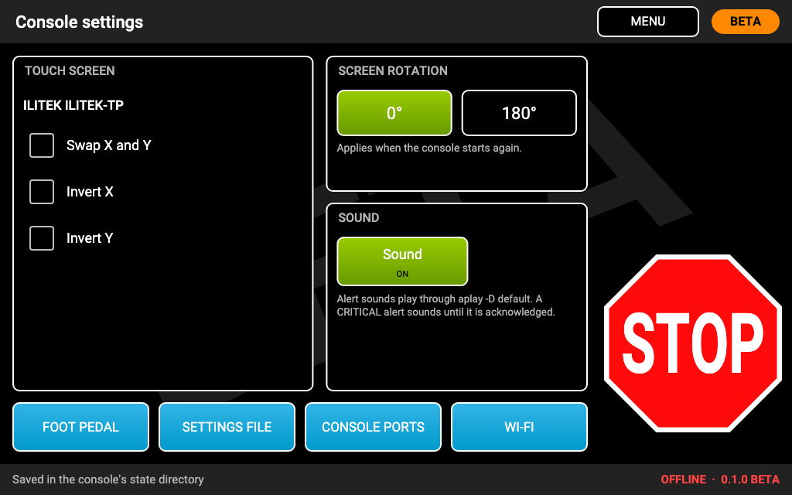
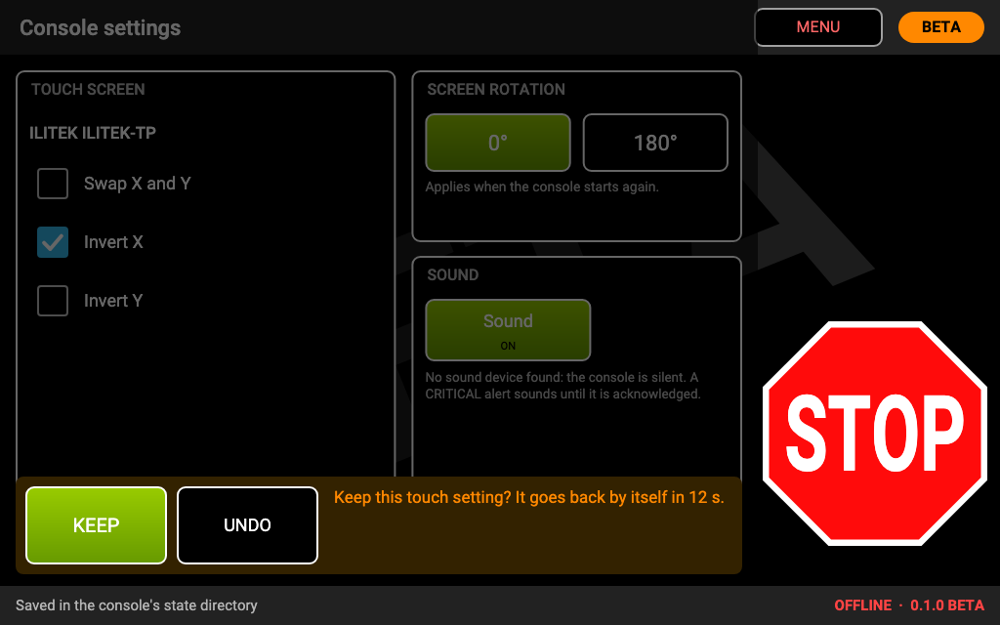
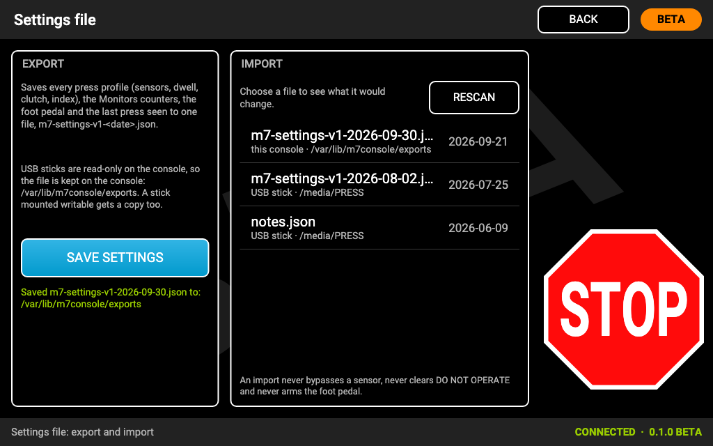
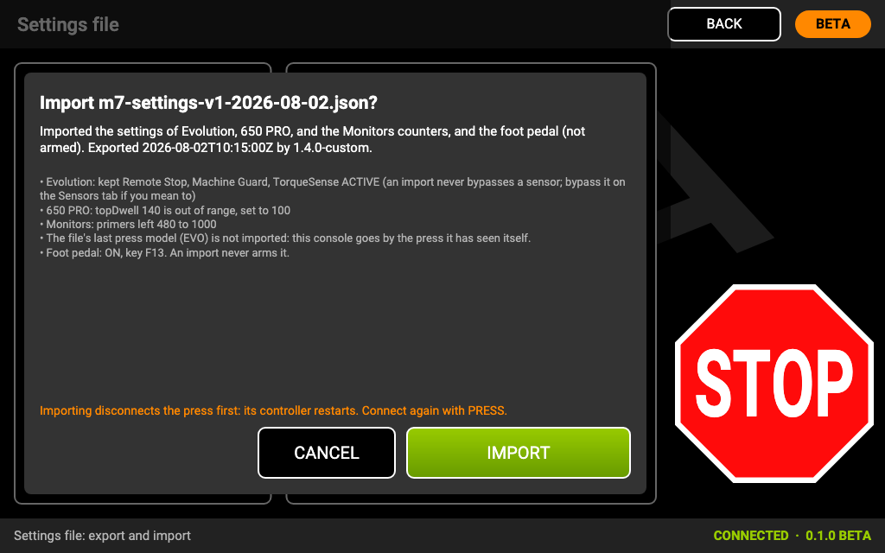

# Console settings

**CONSOLE SETTINGS** on the home screen holds the settings of the console itself (not of the press), and links to
**FOOT PEDAL**, **SETTINGS FILE** and **CONSOLE PORTS**.

## Touch screen

If touches land in the wrong place (for example a tap on the left reacts on the right, or up and down are swapped),
fix it here. The touch panel's name is shown at the top.

- **Swap X and Y:** for a panel whose axes are turned.
- **Invert X:** left and right are mirrored.
- **Invert Y:** top and bottom are mirrored.

A change applies **at once, on trial**: the console asks **"Keep this touch setting? It goes back by itself in 15 s."**
Tap **KEEP** within 15 seconds if touches now land correctly. If you cannot tap KEEP (because touches are now wrong),
just wait: the setting goes back by itself.

Touch settings cannot be changed while the press runs or calibrates: a wrong setting would move STOP to the wrong
place. Stop the press first.

## Screen rotation

**0°** or **180°** (upside down, for a screen mounted the other way up). It applies the next time the console starts:
TURN OFF and switch on again.

## Sound

**Sound ON / OFF.** With sound on, each new alert plays a short tone by its kind, and a **CRITICAL** alert sounds an
alarm every few seconds until you close it. Sound plays through the screen's speaker over HDMI. If the console finds
no sound device, it says so and stays silent; the alerts still show on the screen. Switching sound off silences
everything, the CRITICAL alarm included.

## Settings file: export and import

**SETTINGS FILE** saves and restores the console's settings.

**Export (SAVE SETTINGS)** saves every press profile (sensors, dwell, clutch, index), the Monitors counters, the foot
pedal's settings and the last press seen to one file, `m7-settings-v1-<date>.json`.

- The file is **kept on the console** (it survives software updates). USB sticks are mounted read-only on the console,
  so it cannot be written to a stick.
- Writing a new SD card loses the saved files with everything else.

**Import:** the list shows the settings files saved on the console and those on any USB stick (RESCAN after plugging
a stick in). Tap a file to see **what it would change** first; then **IMPORT** or **CANCEL**.

- Importing **disconnects the press first** (its controller restarts): connect again with PRESS afterwards.
- It is refused while the press runs or calibrates, or a firmware update runs.
- An import **never bypasses a sensor**, never clears DO NOT OPERATE, and never arms the foot pedal. Remote Stop,
  Machine Guard and TorqueSense are switched ACTIVE at the next connection anyway.

## Foot pedal and console ports

- **FOOT PEDAL:** [Foot pedal](foot-pedal.md).
- **CONSOLE PORTS:** [Console ports](console-ports.md).
