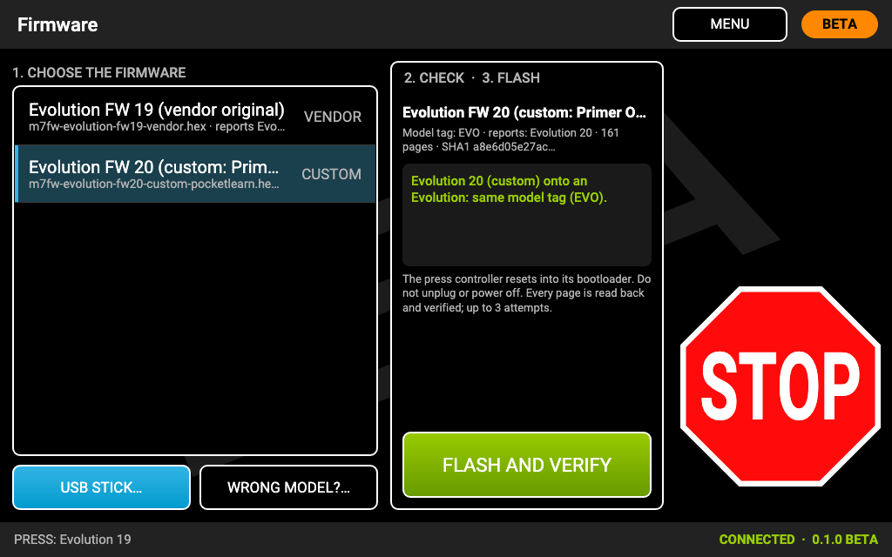
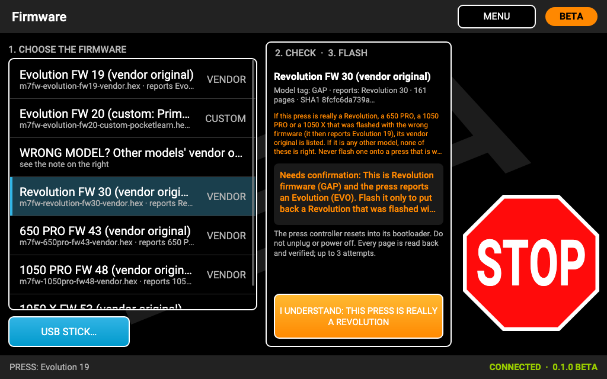
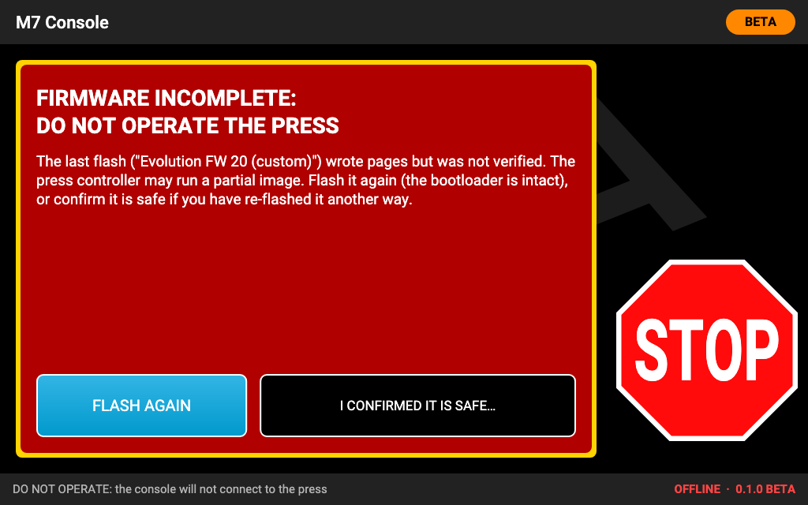

# Press firmware

The press controller inside the press console runs Mark 7's firmware. **You do not need to change it to use M7
Console**: the console works with the firmware your press shipped with. The **FIRMWARE** screen is for putting a
firmware image on the press controller when you want to: Mark 7's original back, or one of the optional custom
builds.

## The images on the console

Every console carries these images; nothing needs downloading. (The release page has the same files, named
`m7fw-*.hex`, for reference and for USB sticks.)

| Image | For | Reports | Kind |
|---|---|---|---|
| Evolution FW 19 (vendor original) | Apex 10 Evolution | Evolution 19 | Mark 7's original, unmodified |
| Evolution FW 20 (custom: Primer Orientation learn fix) | Apex 10 Evolution **only** | Evolution 20 | Custom build of FW 19 |
| Revolution FW 30 (vendor original) | Revolution | Revolution 30 | Mark 7's original, unmodified |
| Revolution FW 31 (custom: Primer Orientation learn fix) | Revolution **only** | Revolution 31 | Custom build of FW 30; **not yet run on a press** |
| 650 PRO FW 43 (vendor original) | 650 PRO AutoDrive | 650 PRO 43 | Mark 7's original, unmodified |
| 1050 PRO FW 48 (vendor original) | 1050 PRO AutoDrive | 1050 PRO 48 | Mark 7's original, unmodified |
| 1050 X FW 53 (vendor original) | 1050 X AutoDrive | 1050 X 53 | Mark 7's original, unmodified (Mark 7 ships it as `___Mark7_mot_1050.hex`) |

There is no image for the 650 X, the 1050 LTE, the Evolution PRO, the Duals or the GAP PRO. None of these images has
been flashed with M7 Console on a real press yet.

## Which one to choose

- **Evolution with Mark 7's Primer Orientation sensor, or none:** Evolution FW 19, what the press shipped with.
- **Evolution with a DIY or replacement Primer Orientation sensor** that does not change state during every
  calibration: Evolution FW 20 (custom).
- **Revolution with Mark 7's sensor, or none:** Revolution FW 30. **With a DIY or replacement sensor:** Revolution
  FW 31 (custom), after reading the warning below.
- **650 PRO, 1050 PRO, 1050 X:** your model's original. There is no custom build for them (their firmware has no
  Primer Orientation sensor).

### The custom "pocketlearn" builds

Mark 7's firmware learns the Primer Orientation sensor during a calibration **only if the calibration sees the sensor
change state**, and forgets it at every restart of the press controller, which happens at every connection. A sensor
that does not change state during calibration is then never checked. The custom builds (Evolution 20, Revolution 31)
change two things only: **they learn the sensor at every CALIBRATE**, and they report a version one higher, so you
can see which firmware is loaded. Everything else is Mark 7's code, unchanged.

- They are **unofficial**, and each is for **its own model only**.
- **Revolution 31 has not yet been run on a press.** The Revolution checks the shell-plate index at different points
  of its stroke than the Evolution, so a sensor that works on an Evolution must be validated again on the Revolution:
  dummy rounds with seated primers (no index alarm), then pull a primer (the press must stop).
- Going back is always possible: flash the vendor original again. A press running a custom build is offered its
  vendor original directly.

## Never cross-flash

All Mark 7 presses speak the same language to the console, so **nothing on the press warns you when it runs another
model's firmware**. The sensor inputs then mean different things (on a 1050, Evolution firmware would read the
SwageSense switch as Primer Orientation) and the motion and torque settings are the other model's. Never flash the
Evolution build on a Revolution or the other way round, never between the Evolution/Revolution and the 650 or 1050,
and never between the 1050 PRO and the 1050 X.

The console enforces this:

- It offers only the images whose **model tag** (written inside the image) matches the press it detected.
- **Custom images** are offered only for their own model.
- A file from a USB stick is checked the same way, including the version its code reports; a custom or unknown file
  for another model is refused.
- **WRONG MODEL?…** lists other models' **vendor originals**, for one case only: a press that was flashed with the
  wrong model's firmware and must be put back. Choosing one needs a warned confirmation ("I UNDERSTAND: THIS PRESS IS
  REALLY A …"). Never do this on a press that is working.

## Flashing

1. Stop the press and connect to it (PRESS, ACCEPT), so the console knows the model. Then **MENU** and
   **FIRMWARE**.
2. **1. Choose the firmware:** tap an image in the list, or **USB STICK…** to pick a `.hex` file from a USB stick
   (FAT or exFAT; the file can be in a folder; sticks are mounted read-only).
3. **2. Check:** the console shows the image's model tag and version and whether it fits: OK, **needs
   confirmation** (a warning you must accept with the orange **I UNDERSTAND: …** button first, for example "I
   UNDERSTAND: THIS PRESS IS REALLY A REVOLUTION"), or **blocked**.
4. **3. Flash:** tap **FLASH AND VERIFY**. The press controller restarts into its bootloader (the motor is off), the
   image is written, and **every page is read back and verified**, with up to 3 attempts. **Do not unplug or power
   off anything** while it writes. CANCEL works only until writing starts.
5. When it is done, the console reconnects by itself and shows the version the press now reports.

**Recovery:** if the press cannot identify itself (for example after an interrupted flash), the FIRMWARE screen shows
the images for **the last press model the console saw**, and checks any file against that model. If the console has
never seen a press, it shows only vendor originals, and every file needs a warned confirmation.

## DO NOT OPERATE

If a flash wrote pages but could not verify them (a cable pulled, a power cut, repeated errors), the press controller
may be running a **partial image**. The console then shows **FIRMWARE INCOMPLETE: DO NOT OPERATE THE PRESS** instead
of the home screen, keeps showing it after restarts, and **will not connect to the press**.

To recover:

- **FLASH AGAIN** (recommended): goes to FIRMWARE. The bootloader is never touched by a flash, so the press can always
  be flashed again. Flash the right image for your press and let it verify.
- **I CONFIRMED IT IS SAFE…**: only if you have re-flashed the press another way and know it is good. It needs two
  taps (the second within a few seconds: **TAP AGAIN: CONNECT TO THIS PRESS**), then the accept screen as before every
  connection.

A flash that failed **before** it wrote anything says so ("Nothing was written; the press firmware is unchanged") and
does not set DO NOT OPERATE.

## Firmware and software updates

Software updates can bring new firmware images. The console keeps **every firmware image it has ever had**: going
back to an older version of M7 Console never takes a newer firmware image away
([Software updates](software-updates.md)).
