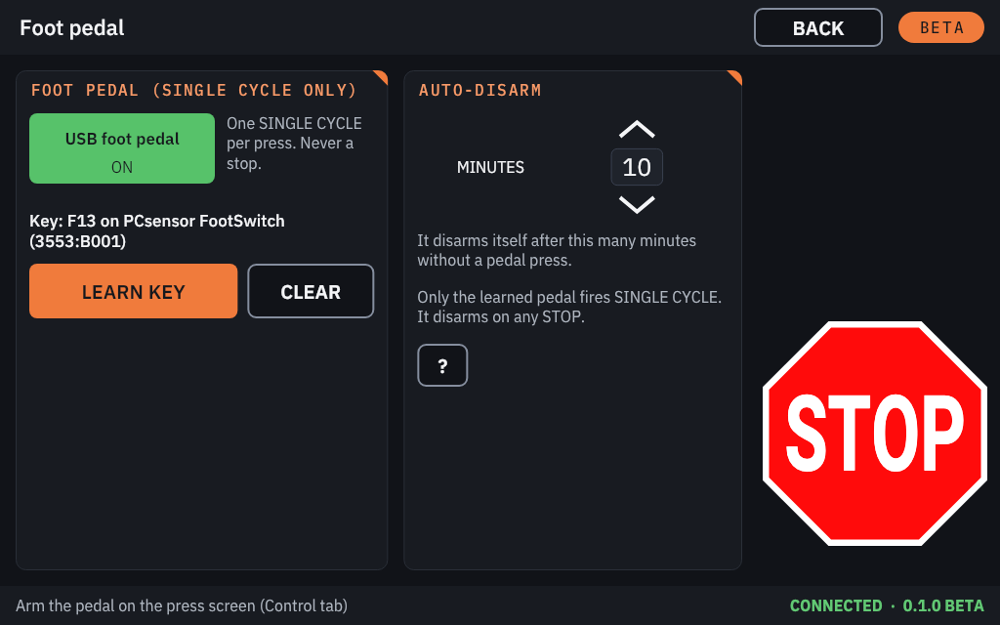
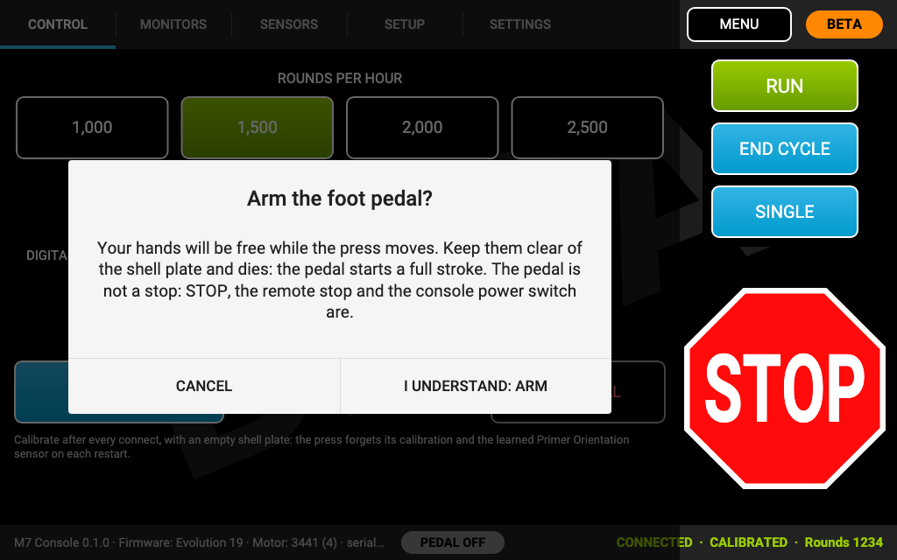
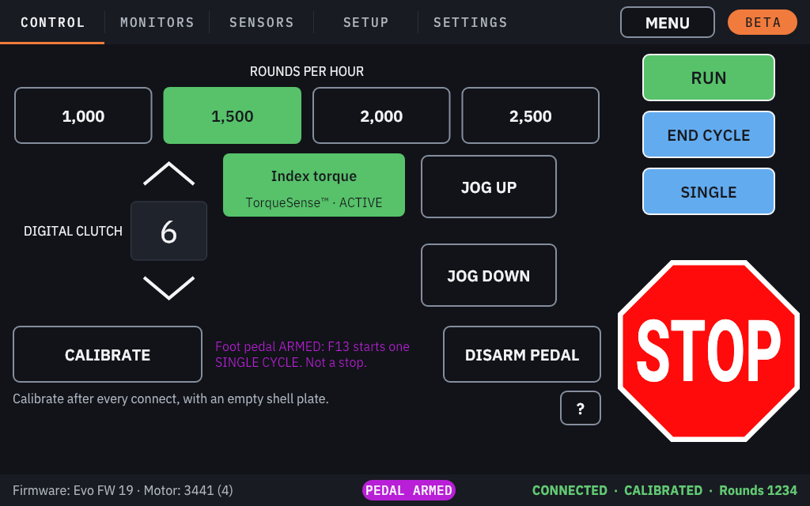

# Foot pedal

A USB foot pedal can start **SINGLE CYCLE**, one cycle per press, so your hands are free to place cases and
projectiles. **It does nothing else.**

> [!WARNING]
> **The pedal is never a stop.** STOP, the remote stop and the press console's power switch are the stops. With the
> pedal armed, the press moves while your hands are free: keep them clear of the shell plate and dies.

> [!NOTE]
> The foot pedal has been tested with the console's simulators, not yet with a real USB pedal on a Raspberry Pi.

## Which pedals work

- Any USB foot pedal that acts as a **keyboard** (it "types" a key when pressed). Plug it into any USB port of the Pi.
- Set it to a key that keyboards rarely send. Best: a pedal you can program to **F13 to F24**.
- Escape, Enter, Space, Tab, Backspace, Delete, the arrows, and the modifier and lock keys cannot be learned.

The console recognises **the learned pedal itself**, by its USB identity and serial number (or the USB port it is in):
the same key typed on another keyboard does not fire SINGLE CYCLE. A pedal moved to another USB port (or one without a
serial number, replaced by another unit) must be learned again.

## Setting it up

1. On the home screen, tap **CONSOLE SETTINGS**, then **FOOT PEDAL**.
2. Switch **USB foot pedal** to **ON** (it is off on a new console).
3. Tap **LEARN KEY**. When the page says "Press the pedal once now.", press the pedal once. The page shows the learned
   key. (**CANCEL LEARN** stops learning; **CLEAR** forgets the key.)
4. Set **Auto-disarm**: the pedal disarms itself after this many **MINUTES** without a pedal press (5 to 30; 10 on a
   new console).

The pedal is armed on the press screen, never on this page.

## Arming it, every session

The pedal works only while it is **armed**, and arming is never remembered: not across connections, restarts or a
settings import.

1. Connect, accept and **CALIBRATE** as usual.
2. On the **Control** tab, tap **ARM PEDAL** (orange).
3. The first time in each connection, the console asks **"Arm the foot pedal?"**: "The pedal starts a full stroke, so
   keep your hands clear of the shell plate and dies. It is not a stop: STOP, the remote stop and the console power
   switch are." Tap **I UNDERSTAND: ARM**, or **CANCEL**.
4. The status bar shows **PEDAL ARMED**. Each pedal press now starts one SINGLE CYCLE, with the same checks as the
   SINGLE button. **DISARM PEDAL** disarms it.

| | |
|---|---|
|  |  |

**ARM PEDAL** needs a learned key and a press with SINGLE CYCLE (not the 1050/1100 LTE). Arming is refused, with
"Can't arm the pedal:" and the reason on the Control tab, before a calibration, while the Remote Stop or the Machine
Guard is bypassed, while a CRITICAL alert is open, and away from the press screen.

## When it disarms itself

The pedal disarms on:

- **any STOP** (at the moment you touch it), any stop alert or CRITICAL alert, and **NEUTRAL**;
- a connection reset or disconnect, a refused command or a press fault;
- bypassing the Remote Stop or the Machine Guard, or losing the calibration;
- the touch screen failing;
- **leaving the press screen** (switching tabs does not disarm it);
- the auto-disarm time without a pedal press.

The Control tab then says "Pedal disarmed:" and why. Arm it again with **ARM PEDAL**.

## How a pedal press counts

- A pedal press is ignored while a question is open on the press screen (a bypass confirmation, the number pad).
- Each press must be released before the next one counts, and holding the pedal down does not repeat.
- Two presses closer than about three quarters of a second count once.
- A press during the cycle it started is ignored ("Pedal ignored: the press is running.").
- A refused pedal press shows one **Not now (pedal)** alert with the reason.
