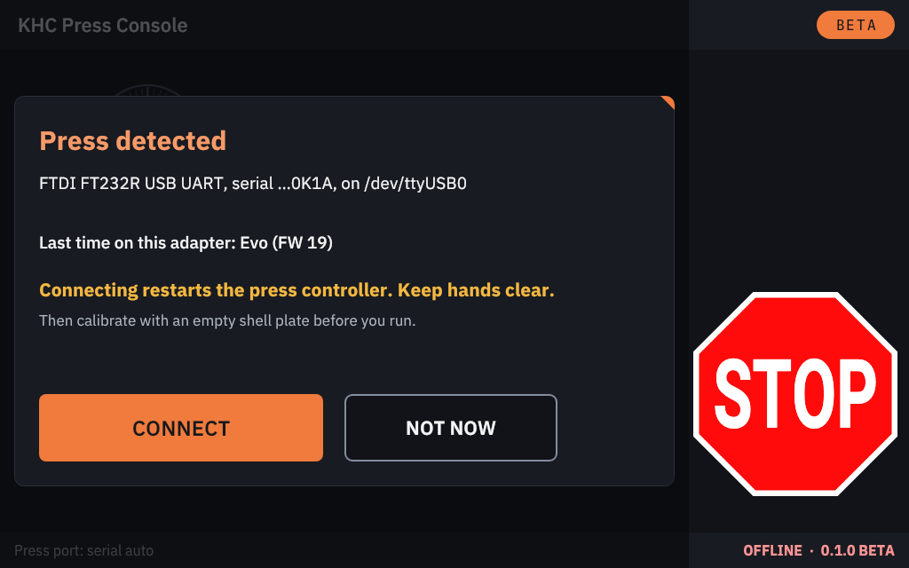
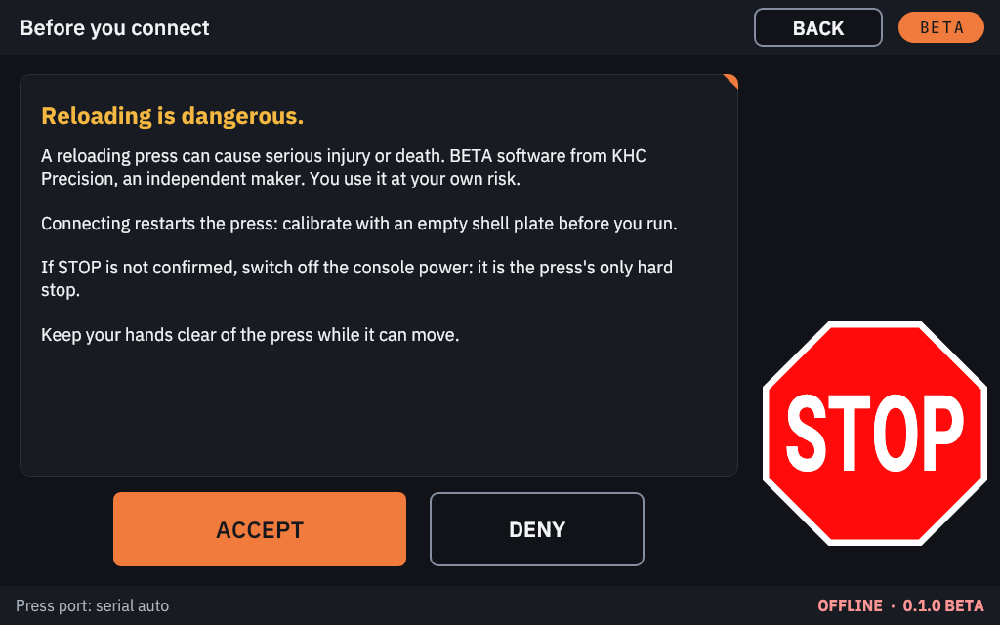
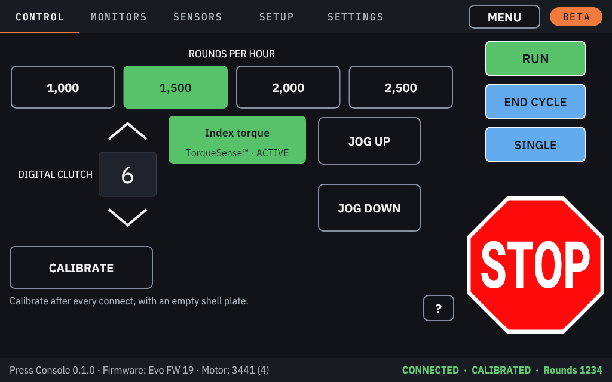

# Getting started

This page wires the console up and walks through a first session. Read [Safety](../../SAFETY.md) first, and have the
card written ([Installing](install.md)).

## Wiring

```
 press console                      Raspberry Pi 4 / 5                    touch screen
 ┌───────────────┐   USB-A to       ┌──────────────────┐  micro-HDMI to   ┌──────────────┐
 │ micro-USB  ●──┼── micro-USB ─────┼─● any USB-A port │  HDMI ───────────┼─● HDMI        │
 │               │   data cable     │ ● HDMI0 ─────────┼──────────────────┘              │
 │ USB-A (motor) │  (never to the   │ ● another USB ───┼── touch USB ─────● touch USB   │
 │ only for the  │   Pi or anything │ ● USB-C power    │                  ● own 5 V power│
 │ ClearPath     │   else)          └──────────────────┘                  └──────────────┘
 └───────────────┘
```

1. **The press:** a **USB-A to micro-USB data cable** from **any USB-A port of the Pi** to the **micro-USB port of the
   press console** (the port Mark 7's tablet used). Charge-only cables do not work.
   - **Never plug anything into the press console's USB-A port** except the cable to the ClearPath motor that is
     already there. That port is the press's link to its motor.
   - Connect **one press** to a console. A second press adapter on the same Pi is not supported.
2. **The screen picture:** a micro-HDMI to HDMI cable from the Pi's **first HDMI port** (HDMI0, the one next to the
   USB-C power input) to the screen.
3. **The touch:** the screen's touch USB cable to any free USB port of the Pi.
4. **Power:** the screen from **its own 5 V supply**, not from a USB port of the Pi (the Pi cannot supply enough
   current for it, and a sagging supply makes the Pi unreliable). The Pi from its own supply.
5. Optional: an Ethernet cable (for online updates through a router, or for a technician's laptop), a USB foot pedal,
   a USB stick.

Plug and unplug **sensors** at the press console only with the console switched off
([Console ports](console-ports.md)).

## Power-on order

1. The press console switched **off**, or on with the press at rest. (KHC Press Console never moves the press by itself:
   nothing is sent until you tap ACCEPT or CONNECT.)
2. Switch on the screen.
3. Plug in the Pi's power. The boot animation plays, then the home screen appears (the very first start takes about
   a minute longer).
4. Switch on the press console if it was off.

## Your first session

Use an **empty shell plate** for your first sessions, keep your hand near the console's power switch, and go one step
at a time.

1. **Plug in the press, tap CONNECT.** When the console sees the press console's USB cable (plugged in, or already
   plugged in when the console starts), it asks: **Press detected**, with the USB adapter, the press it last saw on
   that cable, and **"Connecting restarts the press controller. Keep hands clear."** Tap **CONNECT** to connect, or
   **NOT NOW** (it asks again the next time you plug the cable in).

   

   Or, from the home screen (the status line says **Press not connected**), tap **PRESS**, read the safety text and
   tap **ACCEPT** (or **DENY** to go back).

   

2. **Either way, the console connects and restarts the press controller.** You accept **before every connection**:
   see [The home screen](home-screen.md#accept-before-every-connection).

3. **Wait for the press to be identified.** The status bar at the bottom shows the firmware (for example
   "Firmware: Evo FW 19") and the motor, then **CONNECTED** and **NOT CALIBRATED**. The tabs for your press model
   appear.
4. **Check the interlocks.** On the **Sensors** tab, **Remote Stop** and **Machine Guard** are **ACTIVE** (green).
   Turn on the other sensors that are fitted to your press. Close the guard.
5. **Calibrate.** With the shell plate **empty**, tap **CALIBRATE** on the Control tab. The press moves through its
   calibration. When it succeeds, the status bar shows **CALIBRATED** and **RUN** unlocks.
6. **Test STOP.** Tap **SINGLE**, and tap **STOP** while the press moves. It must stop at once. Test the **Remote
   Stop** and opening the **guard** the same way.
7. **Run.** Choose a speed and tap **RUN**. **END CYCLE** stops at the end of the current cycle; **STOP** stops now.
   See [Calibrating and running](calibrate-and-run.md).



When you are done, tap **MENU** to go back home, and **TURN OFF** before you unplug the Pi
([Turning off](home-screen.md#turning-off)).

## What the console remembers

- Your **press settings** (sensors, clutch, dwell, index and the monitors), per press model. They are sent to the
  press every time it connects, because the press itself forgets them at every restart. The **speed** always starts
  at the slowest, and **Remote Stop, Machine Guard and Index torque (TorqueSense™)** always start **ACTIVE**.
- The **console settings**: touch calibration, screen rotation, sounds, the foot pedal.
- The last press model it saw (used for firmware recovery).

These live on the SD card and survive software updates. A newly written card starts from scratch, and the
[settings files](console-settings.md#settings-file-export-and-import) saved on the old card go with it.
