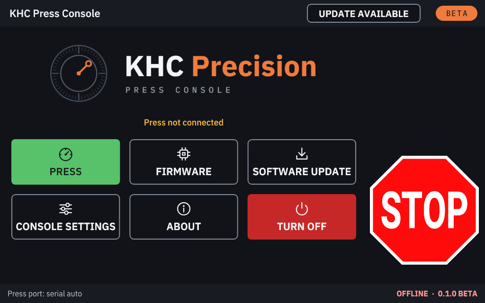

# The home screen

The home screen is where the console starts. **STOP** is on the right, as on every screen.

## The buttons

| Button | What it does |
|---|---|
| **PRESS** | Opens the press screen. When no press is connected, it first shows the **accept** screen, then connects. |
| **FIRMWARE** | Backs up, patches or restores the press controller's firmware ([Firmware](firmware.md)). |
| **SOFTWARE UPDATE** | The console's own version, updates and Wi-Fi ([Software updates](software-updates.md)). |
| **CONSOLE SETTINGS** | Touch calibration, rotation, sounds, the foot pedal, the settings file, console ports, Wi-Fi and the license ([Console settings](console-settings.md)). |
| **ABOUT** | The versions, the trademark note, the terms of use, the license, and the licences of the software on the card ([About](#about)). |
| **TURN OFF** | Disconnects from the press (resetting its controller) and shuts the Pi down ([Turning off](#turning-off)). |

## The status line and the bottom bar

**The status line** under the logo says what the console is doing with the press:

- **Press not connected**
- **Connecting to the press…**
- **Identifying the press…**
- the press model and firmware once it is connected, or a fault the press reported.

**The bottom bar** shows the press port on the left, and on the right the connection state (**OFFLINE**,
**CONNECTED**) and the console's version with **BETA**.

## The top bar badges

The top bar can show two small badges, left of **BETA**. They never pop up and never sound.

**The license badge** says when the console needs your attention for its license. Tap it to open **LICENSE**
([The trial and your license](license.md)).

| Badge | Meaning |
|---|---|
| **TRIAL: 7 DAYS LEFT** (orange) | The trial is running. **TRIAL: LAST DAY** on its last day. |
| **NO LICENSE YET** (red) | Neither the trial nor a license has been started. The press cannot connect. |
| **TRIAL ENDED** (red) | The 10-day trial is over. The press cannot connect until you enter a license. |
| **NOT LICENSED** (red) | The seat was released or ended. The press cannot connect until you enter a license. |
| **LICENSE NOT CHECKED** (red) | The console could not read its license state. The press stays disconnected. |

A licensed console shows no license badge.

**The update badge** says a newer version of the console software can be installed:

- **UPDATE AVAILABLE**: a newer version is out.
- **SAFETY UPDATE** (amber): the newer version fixes a safety problem, or this version is older than the safety
  minimum. Install it soon, with the press stopped.

Tap the badge to open **SOFTWARE UPDATE** with that version highlighted. Nothing is installed until you install it
there ([Update available](software-updates.md#update-available)).

## Accept before every connection

The console asks before **every** connection to the press. There are two ways to connect.

**From PRESS:** the console shows a safety screen, **"Reloading is dangerous."**, with **ACCEPT** and **DENY**. Mark
7's own app works the same way.

**When you plug in the press console's USB cable** (or start the console with it plugged in): the console asks with
**Press detected**. It shows the USB adapter, the press it last saw on that cable, **"Connecting restarts the press
controller. Keep hands clear."**, and **CONNECT** / **NOT NOW**.

- **NOT NOW** (or STOP) closes it. It asks again the next time the cable is plugged in.
- If the cable was pulled out while connected, the button says **RECONNECT**.
- It does not ask while something else is going on (a firmware or software update, an open message, the first-start
  setup, demo mode). It asks once that is over, or you can use PRESS.
- If more than one USB serial adapter is plugged in, or one that cannot run the press, a yellow note at the bottom
  says so instead, and nothing connects.

What happens next:

- **Nothing is sent to the press before you tap ACCEPT or CONNECT.** After a restart of the console, the press is left
  alone until someone accepts.
- **ACCEPT (or CONNECT) connects, and connecting restarts the press controller.** The press forgets its calibration
  (and, with Mark 7's firmware, the learned Primer Orientation sensor). Calibrate again afterwards, with an empty
  shell plate.
- **DENY** goes back to the home screen without connecting.
- If the terms of use have not been accepted, or the console has no trial or license, the console shows the
  **terms** or **LICENSE** first, and does not connect.

The one time the console reconnects without asking is right after a firmware update you started yourself, which it
verified: it reconnects to read the new firmware version.

## The press screen

Once connected, **PRESS** opens the press screen:

- the tabs for your press model along the top ([The press tabs](press-tabs.md));
- **MENU**, back to the home screen (not while the press runs, calibrates or is in die setup);
- the **BETA** badge;
- on the right, the column **RUN / END CYCLE / SINGLE / STOP**, the same on every tab.

If the connection fails, the press screen says why and offers **CONNECT** (which goes through ACCEPT again).

## About

**ABOUT** shows:

- the console app's version, and the SD card image it came on (version and build date);
- who makes it (KHC Precision);
- a note that it is not affiliated with Mark 7 Reloading, Lyman Products or Dillon Precision (their names only
  describe compatibility); its **?** opens the trademark note;
- the license state, with **LICENSE**, and **TERMS OF USE** to read the terms again;
- the licences of the software on the card.

Quote the version from here (or from the bottom bar) in a bug report.

## Turning off

1. Tap **TURN OFF**.
2. Confirm with **TURN OFF** (or tap **CANCEL**).
3. The console disconnects from the press: it sends STOP if the press is still moving (a jog, for example), then
   resets the press controller. Then it shuts the Raspberry Pi down.
4. **Wait until the screen goes dark.**
5. Unplug the Pi, and switch off the press console.

TURN OFF is refused (the screen says why) while the press is running or calibrating, and while a firmware update or a
software update is running. Stop the press first (STOP or END CYCLE), or wait for the update to finish.

Unplugging the Pi without TURN OFF is not dangerous for the press (the controller is reset at the next start), but it
can damage the SD card's contents over time.

> [!IMPORTANT]
> Turning the Pi off **does not switch the press off.** The press console's own power switch does that.
