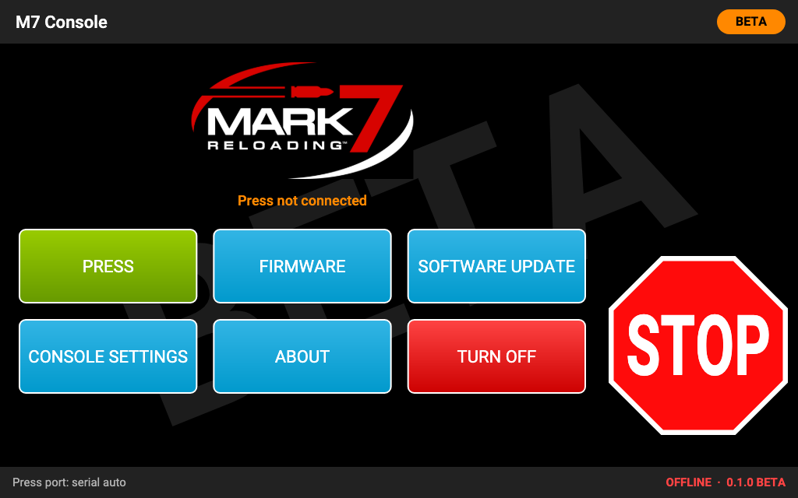

# The home screen

The home screen is where the console starts. **STOP** is on the right, as on every screen.

| Button | What it does |
|---|---|
| **PRESS** | Opens the press screen. When no press is connected, it first shows the **accept** screen, then connects. |
| **FIRMWARE** | Updates the press controller's firmware ([Firmware](firmware.md)). |
| **SOFTWARE UPDATE** | The console's own version, updates and Wi-Fi ([Software updates](software-updates.md)). |
| **CONSOLE SETTINGS** | Touch calibration, rotation, sounds, the foot pedal, the settings file and console ports ([Console settings](console-settings.md)). |
| **ABOUT** | The version of the console app and of the SD card, the Mark 7 trademark note and the licences. |
| **TURN OFF** | Disconnects from the press (resetting its controller) and shuts the Pi down ([Turning off](#turning-off)). |

**The status line** under the logo says what the console is doing with the press: **Press not connected**,
**Connecting to the press…**, **Identifying the press…**, the press model and firmware once it is connected, or a
fault the press reported. The bar at the very bottom shows the press port, the connection state (**OFFLINE**,
**CONNECTED**) and the console's version with **BETA**.

## Accept before every connection

Before **every** connection to the press, the console shows a safety screen: **"Reloading is dangerous."**, with
**ACCEPT** and **DENY**. Mark 7's own app works the same way.

- **Nothing is sent to the press before you tap ACCEPT.** After a restart of the console, the press is left alone
  until someone accepts.
- **ACCEPT connects**, and connecting **restarts the press controller**: the press forgets its calibration (and, with
  Mark 7's firmware, the learned Primer Orientation sensor). You calibrate again afterwards, with an empty shell
  plate.
- **DENY** goes back to the home screen without connecting.

The one time the console reconnects without asking is right after a firmware update you started yourself, which it
verified: it reconnects to read the new firmware version.

## The press screen

**PRESS** opens the press screen once connected: the tabs for your press model along the top, **MENU** (back to the
home screen; not while the press runs, calibrates or is in die setup), the **BETA** badge, and on the right the
column **RUN / END CYCLE / SINGLE / STOP**, the same on every tab. See [The press tabs](press-tabs.md).

If the connection fails, the press screen says why and offers **CONNECT** (which goes through ACCEPT again).

## About

**ABOUT** shows the console app's version, the SD card image it came on (version and build date), a note that Mark 7,
the Mark 7 logo and the press names belong to Mark 7 Reloading, and the licences of the software on the card. Quote the
version from here (or from the bottom bar) in a bug report.

## Turning off

Tap **TURN OFF**, then confirm with **TURN OFF** (or **CANCEL**). The console:

1. disconnects from the press: it sends STOP if the press is still moving (a jog, for example), then resets the
   press controller;
2. shuts the Raspberry Pi down.

**Wait until the screen goes dark**, then unplug the Pi and switch off the press console. Unplugging the Pi without
TURN OFF is not dangerous for the press (the controller is reset at the next start), but it can damage the SD card's
contents over time.

TURN OFF is refused (the screen says why) while the press is running or calibrating, and while a firmware update or a
software update is running: stop the press first (STOP or END CYCLE), or wait for the update to finish.

Turning the Pi off **does not switch the press off.** The press console's own power switch does that.
