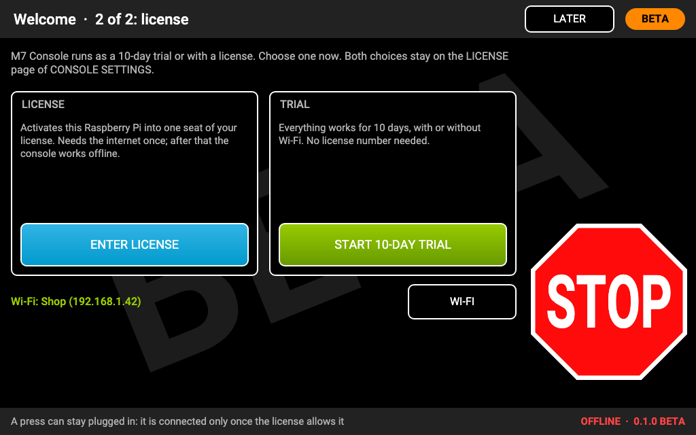
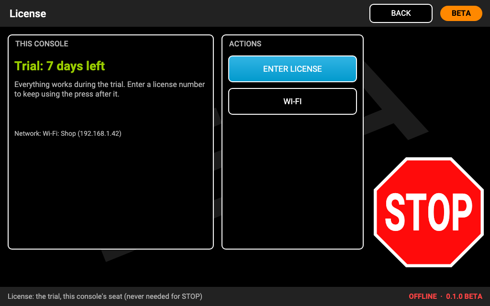
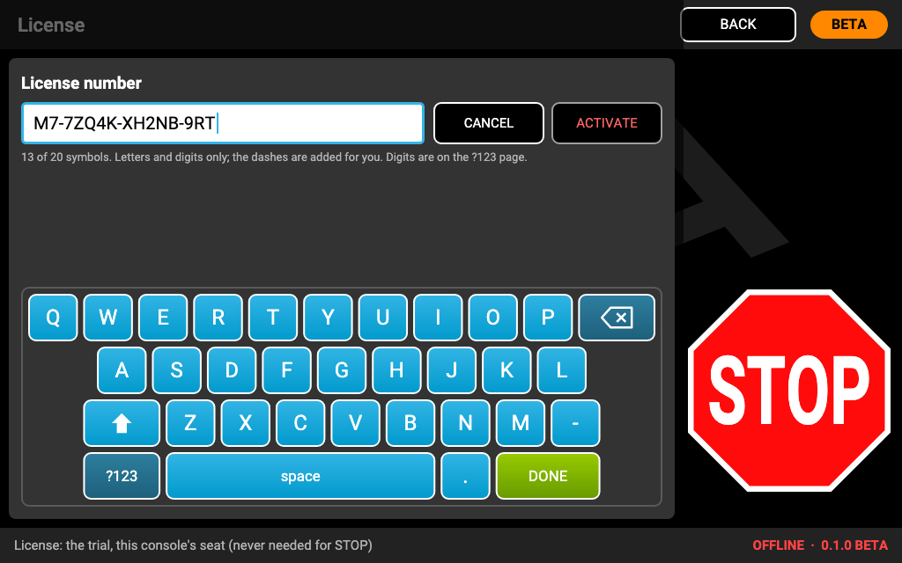
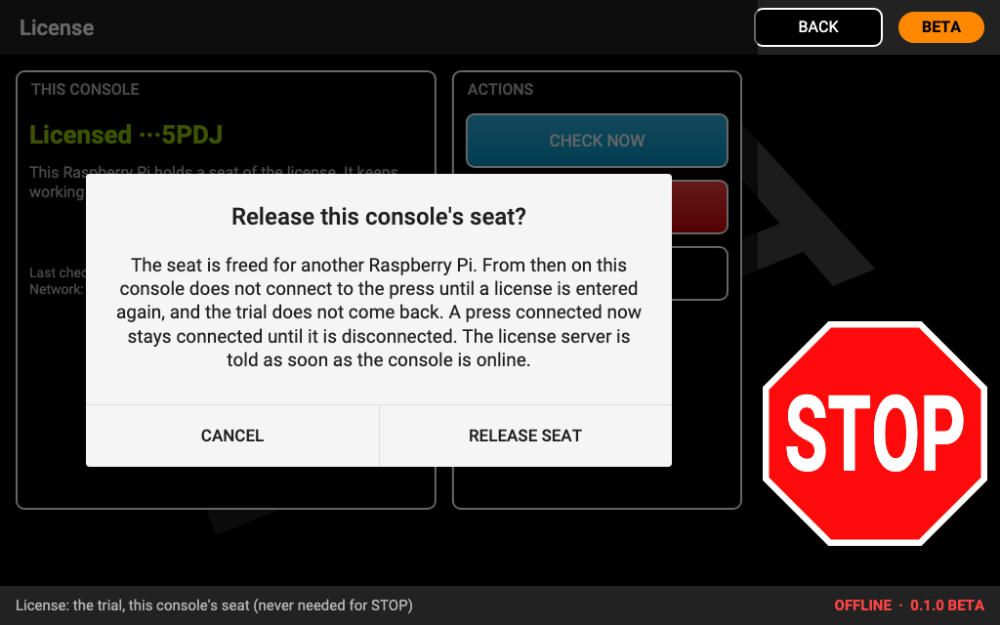

# The trial and your license

M7 Console is an evaluation release. A new card runs as a **10-day trial**. A **license number** activates the
Raspberry Pi for good, and from then on it works without Wi-Fi.

**STOP always works,** whatever the license says. Without a valid trial or license the console only refuses to
**connect** to a press or to **start a firmware flash**. It never interrupts a press that is already connected and
running. A press left **DO NOT OPERATE** by a failed flash can always be flashed again. It stays disconnected
afterwards until the console has a trial or a license.

## The first start

After the card's first start the console asks two things:

1. **Wi-Fi.** Set up Wi-Fi now, or tap **SKIP**. Wi-Fi is needed only to activate a license.
2. **License or trial.**

- **ENTER LICENSE** activates this Raspberry Pi into one seat of your license. It needs the internet once.
- **START 10-DAY TRIAL** starts the trial at once, with or without Wi-Fi. No license number is needed.
- **LATER** goes to the home screen. Both choices stay on **CONSOLE SETTINGS**, **LICENSE**, and the press cannot
  be connected until you pick one.

## The trial

The trial runs for **10 days**. The home screen shows the days left, and so does the **LICENSE** page.

- With Wi-Fi at any time, the console counts calendar days. Without Wi-Fi it counts the time it has been switched on,
  because the Raspberry Pi has no battery clock. Setting the clock does not extend the trial.
- When the trial ends, the press can no longer be connected. Enter a license number to carry on. Writing a new card
  also starts a new trial.

## Activating a license

1. Connect Wi-Fi (**CONSOLE SETTINGS**, **WI-FI**).
2. Open **CONSOLE SETTINGS**, **LICENSE**, and tap **ENTER LICENSE**.
3. Type the license number, for example `M7-XXXXX-XXXXX-XXXXX-XXXXX`. The dashes are added for you, and the last
   symbol is a check: a mistyped number is caught before anything is sent.
4. Tap **ACTIVATE**.

When it succeeds, the **LICENSE** page shows the license's last four symbols. The console now works **offline for
good**. While Wi-Fi happens to be connected it checks in with the license service, so a seat released by the
license's owner takes effect then.

**The license number is never stored on the console** and never appears in its logs or in **SAVE LOGS**.

### What the messages mean

| Message | What to do |
|---|---|
| Connect to Wi-Fi first. | Set up Wi-Fi, then try again. |
| That is not a valid license number. | Check the number and type it again. |
| License number not recognized. | Check the number with whoever gave it to you. |
| All seats on this license are in use. | Release a seat on another console, or ask for more seats. |
| This license has been revoked. | Contact whoever gave you the license. |
| The license server is busy. | Try again in a few minutes. |

## Seats: one license, several consoles

A license has one or more **seats**. Each seat belongs to **one Raspberry Pi**: to the Pi itself, not to the SD card.

- **A new card in the same Pi** gets that Pi's own seat back when you enter the number again. It does not use a
  second seat.
- **The card moved to a different Pi** counts as a new console. It needs a free seat.
- **Moving a seat to another Pi:** on the old console, with Wi-Fi, open **CONSOLE SETTINGS**, **LICENSE**, tap
  **RELEASE SEAT** and confirm. Then enter the number on the new console. After a release the old console no longer
  connects to a press, and its trial does not come back.
- **A console that is broken or lost** cannot release its seat. Ask whoever gave you the license to free it.

