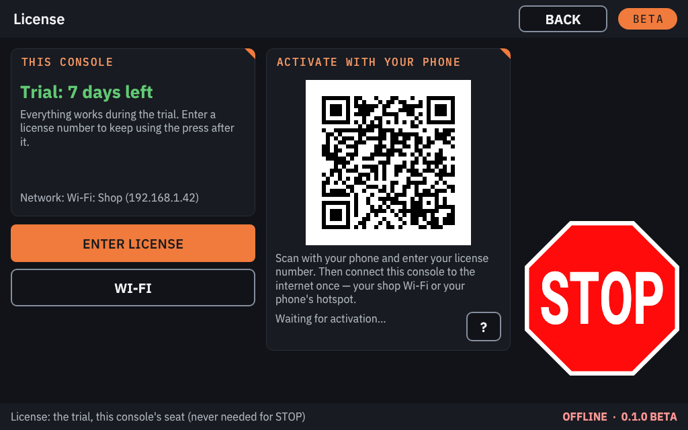
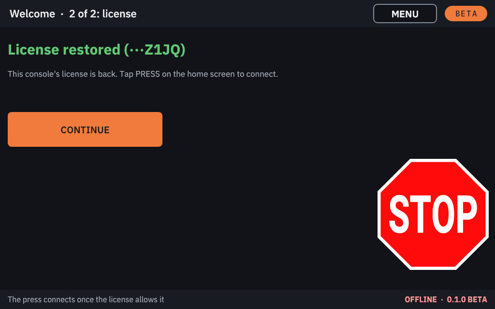

# The trial and your license

A new console runs as a **10-day trial**. A **license number** then activates the Raspberry Pi into a **seat** of your
license, for good. A licensed console works offline. You can type the license number on the console, or enter it on
your phone by scanning the code the console shows.

> [!IMPORTANT]
> **STOP always works, whatever the license says.** Without a valid trial or license, the console only refuses to
> **connect** to a press and to **start a firmware flash**. It never interrupts a press that is already connected.
> STOP, Wi-Fi and software updates always work.

A press left **DO NOT OPERATE** by a failed flash can always be flashed again. It then stays disconnected until the
console has a trial or a license.

## The first start

On the card's first start the console asks three things, in this order.

1. **The terms of use.** They open by themselves, page by page. Read them and tap **I AGREE** on the last page. Until
   you do, the console does not connect to a press (**DECLINE** leaves them for now; **PRESS** shows them again). The
   same text is in [Terms of use](../../TERMS.md), and on the console under **ABOUT**, **TERMS OF USE**.
2. **Wi-Fi** ("Welcome · 1 of 2"). Set up Wi-Fi now, or tap **SKIP**. Wi-Fi is needed to activate a license, not for
   the trial.
3. **License** ("Welcome · 2 of 2"). If this Raspberry Pi was licensed before (you wrote a new card for it), the
   console first checks for its license and says **License restored**: tap **CONTINUE**, you are done. Otherwise,
   choose:
   - **ENTER LICENSE** to type your license number ([Activating with the license number](#activating-with-the-license-number));
   - **Activate with your phone**, the code on the right on cards written with 0.3.0b3 or later ([Activating with your phone](#activating-with-your-phone));
   - **START 10-DAY TRIAL** to start the trial at once, with or without Wi-Fi;
   - **LATER** to go to the home screen. The press cannot connect until you choose. The choices stay on
     **CONSOLE SETTINGS**, **LICENSE**.

## The trial

The trial runs for **10 days**. Everything works during the trial.

- The home screen's top bar shows the days left (**TRIAL: 7 DAYS LEFT**), and so does the **LICENSE** page.
- Once the console has been online, the trial counts calendar days. Without the internet it counts the time the
  console has been switched on, because the Raspberry Pi has no battery clock.
- Setting the clock does not extend the trial.
- When the trial ends, the press can no longer be connected. Enter a license number to carry on.

## Activating with the license number

1. Connect the console to the internet: Wi-Fi (**CONSOLE SETTINGS**, **WI-FI**) or an Ethernet cable.
2. Open **CONSOLE SETTINGS**, **LICENSE**, and tap **ENTER LICENSE**.
3. Type the license number, for example `M7-XXXXX-XXXXX-XXXXX-XXXXX`. The dashes are added for you; digits are on
   the **?123** page of the keyboard. The last symbol is a check: a mistyped number is caught before anything is
   sent.
4. Tap **ACTIVATE**.

When it succeeds, the **LICENSE** page shows **Licensed** and the license's last four symbols. The console now works
**offline for good**.

- While it is online, a licensed console checks in with the license server from time to time. **CHECK NOW** checks
  at once.
- **The license number is never stored on the console.** Its logs show at most the last four symbols.

## Activating with your phone

You type nothing on the console. The console needs the internet only once, and your phone can share its own.

1. Open **CONSOLE SETTINGS**, **LICENSE** (or the first-start license step). It shows **Activate with your phone** and
   a square code.
2. Scan the code with your phone's camera. A page opens on khcprecision.com.
3. Type your license number on that page and tap **ACTIVATE**. The page says **Ready**.
4. **Within 24 hours,** connect the console to the internet once: tap **WI-FI** and pick your shop's Wi-Fi, or your
   phone's hotspot (below).
5. The console activates by itself, usually within a minute, and shows **Licensed**. From then on it works offline.

**No camera on your phone?** Tap **ENTER LICENSE** and type the number on the console instead.

After you released this console's seat, the code is shown only when you tap **ACTIVATE WITH YOUR PHONE**.

Phone activation needs a card written with 0.3.0b3 or later. Older cards show only **ENTER LICENSE**.

### Using your phone's hotspot

If the shop has no Wi-Fi, let the console use your phone's internet for a minute.

1. Turn on your phone's hotspot:
   - **iPhone:** Settings, **Personal Hotspot**, turn on **Allow Others to Join**. Note the Wi-Fi password shown
     there.
   - **Android:** Settings, **Network** (or **Connections**), **Hotspot**. Turn it on, and note its name and password.
2. On the console, tap **WI-FI**, pick your phone's hotspot and type its password.
3. Once the console says **Licensed**, you can turn the hotspot off.

Connecting the phone by USB cable is not supported.

## A new SD card in a licensed console

You do not need the license number to write a new card for a Raspberry Pi that is already licensed.

1. Write the new card and start the console.
2. Connect it to the internet (Wi-Fi or your phone's hotspot).
3. The console gets its license back by itself and says **License restored**. It uses the same seat, not a new one.

This works with cards written with 0.3.0b3 or later. On an older card, enter the same license number again: the Pi
gets its own seat back.

## Seats: one license, several consoles

A license has one or more **seats**. Each seat belongs to **one Raspberry Pi**: to the Pi itself, not to the SD card.

- **A new card in the same Pi** gets that Pi's own seat back. It does not use a second seat.
- **The card moved to a different Pi** counts as a new console. It needs a free seat.
- **A console that is broken or lost** cannot release its seat. Ask KHC Precision to free it.

### Moving a seat to another Pi

1. On the old console, open **CONSOLE SETTINGS**, **LICENSE**, and tap **RELEASE SEAT**.
2. Read the question and confirm with **RELEASE SEAT**.
3. Keep the old console online until the seat is released: the seat is freed when the old console reaches the license
   server.
4. Activate the new console with the number or your phone.

After a release, the old console no longer connects to a press, and its trial does not come back.

## What the messages mean

| Message | What to do |
|---|---|
| Connect to Wi-Fi first. | Connect Wi-Fi or an Ethernet cable, then try again. |
| That is not a valid license number. Check it and try again. | Check the number and type it again. |
| License number not recognized. | Check the number with KHC Precision. |
| All seats on this license are in use. Release one on another console, or add seats. | Release a seat on another console, or ask KHC Precision for more seats. |
| This license has been revoked. | Contact KHC Precision. |
| This console's license could not be restored. Enter your license number. | Type the license number on the console (**ENTER LICENSE**). |
| The license server is busy. Try again in a few minutes. | Wait, then try again. |
| Could not reach the license server securely (check the date and Wi-Fi). | Check the network, wait a minute, then try again. |
| This console is already licensed. | Nothing to do: the console found its license by itself. |

## Buying a license

Licenses are sold by KHC Precision: see [khcprecision.com](https://khcprecision.com). The price is in the quote or
invoice you receive when you buy. Refunds follow the refund policy at khcprecision.com/refunds#licenses
([Terms of use](../../TERMS.md)).

A licensed console can also be offered pre-release versions for testing, when KHC Precision assigns them
([Pre-release versions for testers](software-updates.md#pre-release-versions-for-testers)).
