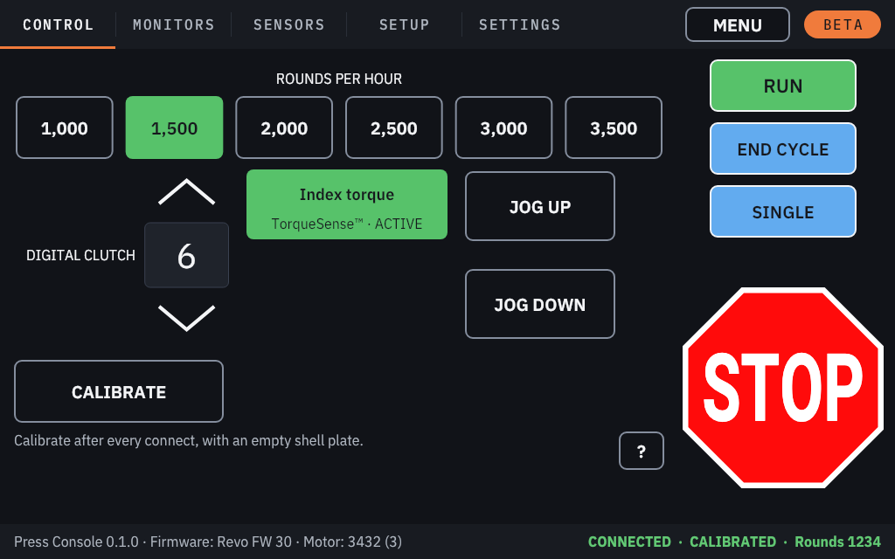
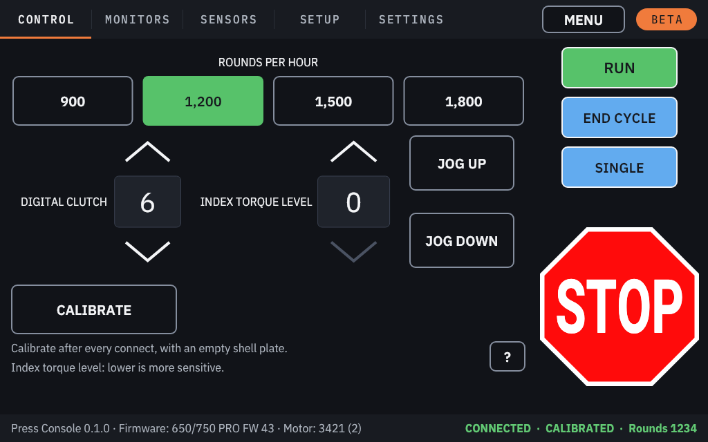
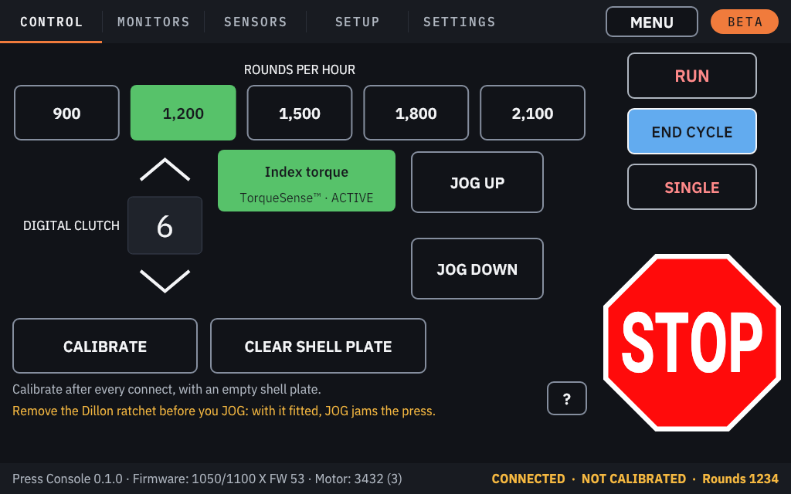
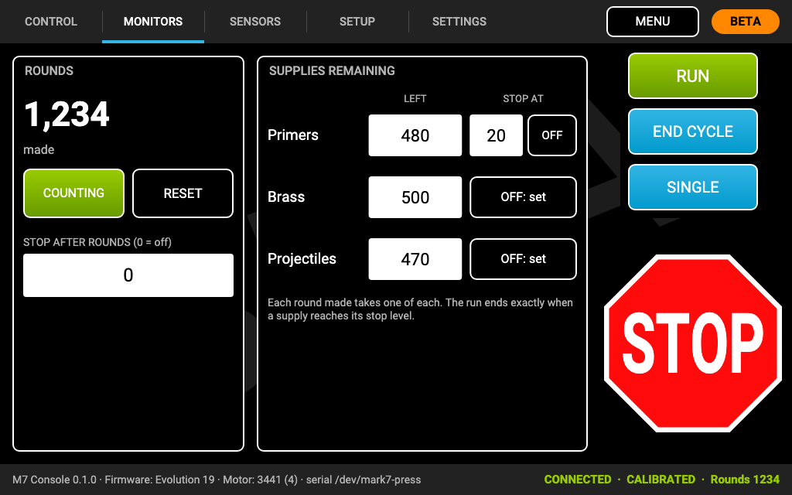
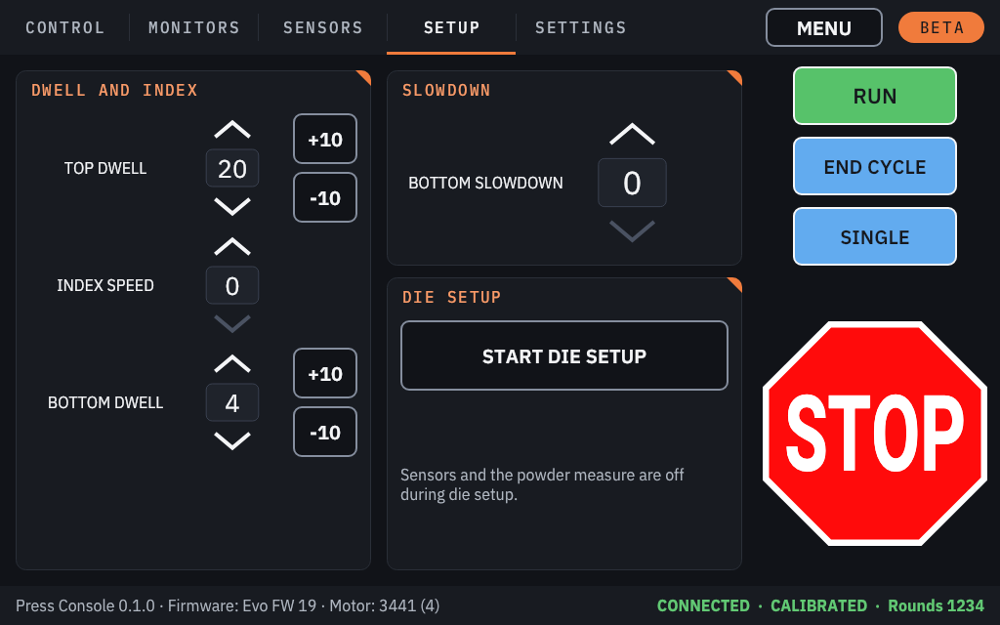
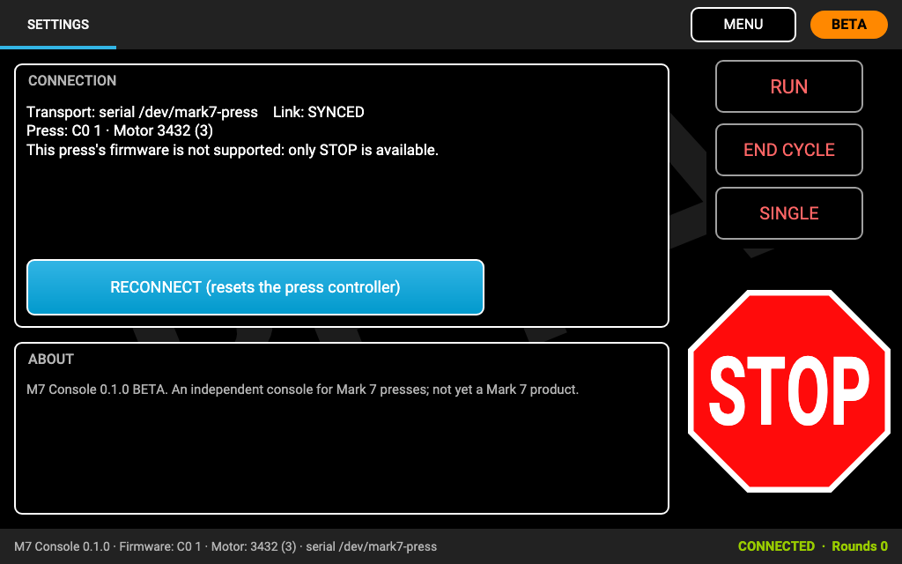

# The press tabs

Tap **PRESS** on the home screen to open the press screen. Its tabs run along the top, the run column (RUN, END
CYCLE, SINGLE, STOP) is on the right, and the status bar is at the bottom. **MENU** returns to the home screen; it is
not available while the press runs, calibrates or is in die setup.

## Which tabs your press has

| Press | Tabs |
|---|---|
| Evo, Evo PRO, Evo Dual, Revo, Revo Dual, GAP PRO, 650/750 X and PRO, 1050/1100 X and PRO | **CONTROL**, **MONITORS**, **SENSORS**, **SETUP**, **SETTINGS** |
| 1050/1100 LTE | **CONTROL**, **SENSORS**, **SETTINGS** |
| A press whose firmware the console does not recognise | **SETTINGS** only ([STOP-only mode](#stop-only-mode)) |

The console names the presses this way: **Evo** is Mark 7's Apex 10 Evolution, **Revo** the Revolution, and
**650/750** and **1050/1100** are the Dillon presses that Mark 7's drives fit.

Until the press has identified itself and its settings are restored, the other tabs show why they are not ready
("Connecting to the press…", "Waiting for the press to identify itself…", "Restoring your settings on the press…").
The Settings tab stays usable. If the connection failed, the tabs show the reason and a **CONNECT** button.

## The status bar

- **Left:** the console's version, the press firmware (**Firmware: Evo FW 19**) and motor, and **CUSTOM FW** when the
  press runs firmware that is not Mark 7's (for example the KHC patch). With the foot pedal turned on, the version is
  left out to make room for the **PEDAL OFF** / **PEDAL ARMED** chip.
- **Right:** the connection (**CONNECTED**), the press state (**NOT CALIBRATED**, **CALIBRATING**, **CALIBRATED**,
  **RUNNING** or **ENDING**), the rounds per hour while running, and the round count.

## Control

| Control | What it does | Which presses |
|---|---|---|
| **ROUNDS PER HOUR** | The speed. Always the slowest when the console connects. | All |
| **DIGITAL CLUTCH** | The torque limit for the stroke. A jam above it stops the press with **Jam: Digital Clutch**. | All (LOW, MED, HIGH, MAX on the 1050/1100 LTE) |
| **Index torque** (TorqueSense™ on its second line) | **ACTIVE** or **BYPASSED**. Stops the press when the shell plate meets resistance while it indexes. Switched **ACTIVE at every connection**. | Evo and Revo models, 1050/1100 PRO and X |
| **INDEX TORQUE LEVEL** | The torque while the shell plate indexes, below the clutch. Lower is more sensitive. | 650/750 (instead of Index torque) |
| **Index Slowdown** | ON or OFF. | 1050/1100 LTE |
| **JOG UP** / **JOG DOWN** | A short move ([JOG](calibrate-and-run.md#jog)). | All except the 1050/1100 LTE |
| **CALIBRATE** | Calibrates the press ([CALIBRATE](calibrate-and-run.md#calibrate)). | All |
| **CLEAR SHELL PLATE** | The press's shell-plate clearing move. | 1050/1100 PRO and X |
| **ARM PEDAL** / **DISARM PEDAL** | The foot pedal ([Foot pedal](foot-pedal.md)). | With a foot pedal turned on, on presses with SINGLE |

Under the buttons, a short line says what matters most: "Calibrate after every connect, with an empty shell plate."
On a 1050/1100 a second line warns you to remove the Dillon ratchet before you JOG.

### Revo and 650/750 PRO

| | |
|---|---|
|  |  |

### 1050/1100 PRO and X

| | |
|---|---|
|  |  |

## Monitors

- **Rounds:** the rounds made, **COUNTING** / **PAUSED**, **RESET**, and **STOP AFTER ROUNDS (0 = off)**.
- **Supplies remaining:** **Primers**, **Brass** and **Projectiles** left, each with an optional **STOP AT** level
  (**OFF: set** to add one, **OFF** to remove it). Each round made takes one of each.
- When a counter reaches its stop level, the run ends at the end of that cycle, with the **Stopping at end of cycle**
  alert.
- RUN is refused while a supply is already at its stop level: refill and correct the count, or switch that stop off.

Tap a number to change it on the on-screen number pad.

## Sensors

Every sensor your press model has, each **ACTIVE** (green: its checks are on) or **BYPASSED** (dark: the press
ignores it). Tap a button to switch it.

- Each button names the sensor plainly (**Bullet sensor**); where Mark 7 sells it under its own name, that name is on
  the second line with the state (**BulletSense™ · BYPASSED**).
- The tag on top is the **console port** it plugs into (**PORT 3**), from your press model's manual. The buttons are in
  port order, lowest first. A sensor with no numbered port (the Machine Guard on most models) has no tag and comes
  last. The Evo PRO, the Duals and the GAP PRO show no port tags (their own manuals were not available).
- Short notes sit under the buttons; the **?** at the top opens the full notes for your model.
- While the Remote Stop or the guard is bypassed, the tab says **INTERLOCK BYPASSED** in red instead.

Details, and which sensors start active: [Sensors and interlocks](sensors-and-interlocks.md).

## Setup

- **Dwell and index:** **TOP DWELL** (with **+10** and **-10**), **INDEX SPEED**, **BOTTOM DWELL**.
- **650/750:** the section is **Dwell, index and primer depth**, and the bottom setting is **PRIMER DEPTH**: how deep
  primers are seated, 0 being the deepest. Change it one step at a time, never while cycling, and check the seated
  primers with SINGLE before you RUN.
- **Slowdown:** **BOTTOM SLOWDOWN** for big brass (Evo and Revo models, 1050/1100 PRO and X), or the **Top Slowdown**
  switch on the 650/750 (it slows the start of the return stroke so cases stay on the powder funnel).
- **Die setup:** **START DIE SETUP**, the moves and **FINISH DIE SETUP**
  ([Die setup](calibrate-and-run.md#die-setup)).

## Settings

- **Connection:** the connection, the press and its firmware, the motor, and the press model's layout.
- **RECONNECT (resets the press controller):** disconnects and connects again. Calibrate again afterwards.
- **About:** the console's version and maker.
- **CONSOLE PORTS:** which sensor goes into which port ([Console ports](console-ports.md)). Not while the press moves.

## STOP-only mode

If the press reports firmware the console does not know, you get only the Settings tab, which says "This press's
firmware is not supported: only STOP is available." RUN, END CYCLE and SINGLE are disabled; **STOP works**. Use Mark
7's own console for such a press, or report its firmware version as an
[issue](https://github.com/Shane-Cotta/khc-press-console/issues/new/choose).

## Details, notes and numbers

- A **?** button opens the longer explanation behind a short line, over the left part of the screen. RUN, END CYCLE,
  SINGLE and STOP stay where they are and keep working. **CLOSE** (or STOP) closes it.
- Numbers (counters, stop levels) are typed on an on-screen number pad.

## The 650/750 and 1050/1100 presses

The console supports Mark 7's drives for the Dillon 650 and 750 (**650/750 PRO** and **X**; we believe a 750 drive
reports itself as a 650 model) and for the Dillon 1050 and 1100 (**1050/1100 PRO**, **X** and **LTE**).

> [!CAUTION]
> **None of these has been run with KHC Press Console yet.** The support comes from Mark 7's manuals and from reading
> their firmware. Run your first sessions with an empty shell plate, and keep the power switch within reach.

- On a 650/750, change **PRIMER DEPTH** one step at a time and check seated primers with SINGLE before you RUN.
- On a 1050/1100, **remove the Dillon ratchet before you JOG**.
- On a 1050/1100, console **port 2 is the swage sensor**: never connect a DIY Primer Orientation sensor to it.
