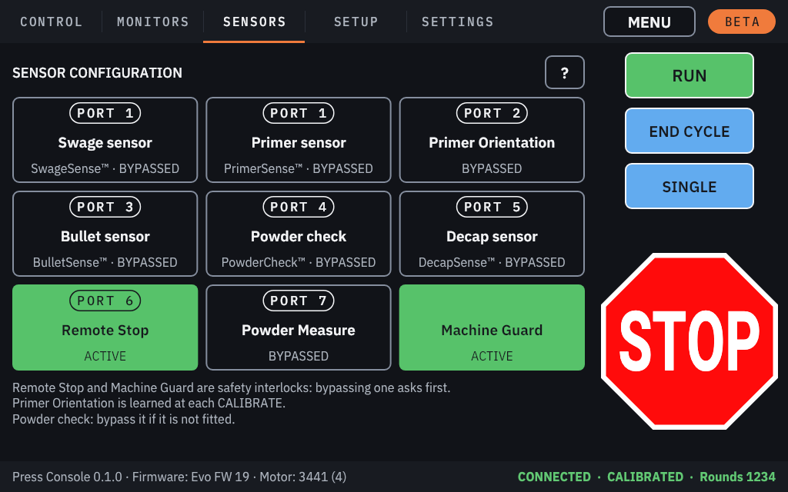

# Sensors and interlocks

Each sensor on the **Sensors** tab is either:

- **ACTIVE** (green): the press checks it and stops (or ends the run) when it trips;
- **BYPASSED** (black): the press ignores it. **A bypassed sensor or interlock does not stop the press.**

The press itself forgets these settings at every restart, so the console sends them again after every connection.

The buttons are in **console-port order**: each shows the port its sensor plugs into (**PORT 3**), lowest port first,
and a sensor with no numbered port (the Machine Guard) last, so the tab follows the cables at the back of the console.
Each sensor has a plain name (**Bullet sensor**); where Mark 7 sells it under its own name, that name is on the
button's second line with ACTIVE or BYPASSED (**BulletSense™ · ACTIVE**).

## What starts active

| | On a new console | At every connection |
|---|---|---|
| **Remote Stop** | ACTIVE | **Switched ACTIVE**, whatever it was before |
| **Machine Guard** (the **Safety Shield** on a 1050/1100) | ACTIVE | **Switched ACTIVE**, whatever it was before |
| **Index torque** (TorqueSense™) | ACTIVE | **Switched ACTIVE**, whatever it was before (it is on the Control tab) |
| Top Slowdown (650/750) | ACTIVE | as you left it |
| Primer sensor (PrimerSense™) on the Revo | ACTIVE | as you left it |
| Every other sensor (decap, swage, bullet and primer sensors, Primer Orientation, Powder Measure, powder check) | BYPASSED, as in Mark 7's app | as you left it |

**Turn on the sensors that are fitted to your press**, and check that each one stops the press before you rely on
it. An unfitted sensor that is ACTIVE can stop every run.

## Bypassing an interlock

- **Remote Stop** and **Machine Guard** are safety interlocks. Bypassing either one **asks for confirmation** first.
  It then shows **BYPASSED**, and the tab says **INTERLOCK BYPASSED**.
- The bypass lasts **until the next connection**: every connection switches both back to ACTIVE.
- Index torque (TorqueSense™) can be bypassed on the Control tab without a confirmation; it too is switched back to ACTIVE at the
  next connection.
- The foot pedal cannot be armed while the Remote Stop or the Machine Guard is bypassed, and bypassing either one
  disarms it.

Bypass an interlock only for a specific reason, never while anyone can reach into the press, and turn it back on as
soon as you can.

## What the guard does and does not stop

With the **Machine Guard** (or the 1050/1100's **Safety Shield**) open, the press refuses **only RUN, SINGLE CYCLE, END
CYCLE and CALIBRATE** (on the 1050/1100 LTE: RUN, HOME and CALIBRATE). **Every other move still moves the press with the
guard open:** JOG UP / JOG DOWN, CLEAR SHELL PLATE, CLEAR CASE (the swage sensor alert's button) and the die-setup moves,
on the models that have them. This is how the press firmware works, with Mark 7's app as well. The guard alert and the
Sensors tab's notes (its **?** button) name the moves your press has.

## Notes on particular sensors

- **Primer Orientation** (Evo, Revo): learned during calibration; its checks run only once it has been
  learned. With Mark 7's firmware a calibration learns it only if it sees the sensor change state, and every restart
  of the press (every connection) forgets it. The KHC primer-learn patch learns it at every calibration
  ([The KHC Primer Orientation sensor](#the-khc-primer-orientation-sensor)).
- **Decap sensor** (DecapSense™): plug it in **before** the console connects: the press looks for it only when it
  starts, and every connection restarts it. The press remembers a decap sensor it has seen, so if you unplug one,
  either plug it back in or bypass it.
- **Powder check** (PowderCheck™) and **Powder Measure:** bypass them if they are not fitted; an unfitted one is likely to
  stop runs with a malfunction or powder check alert.
- **650/750 and 1050/1100:** these presses have no Primer Orientation sensor, and the console does not show one. On
  a 1050/1100, console **port 2 is the swage sensor**: never plug a DIY Primer Orientation sensor in there. On these presses the Powder
  Measure input is always kept bypassed.

## The KHC Primer Orientation sensor

A KHC (or other replacement) Primer Orientation sensor checks that a case is present and its primer seated at the
priming station, like Mark 7's. Mark 7's firmware uses it only after a calibration that sees it change state, which a
replacement sensor may never do, so it can be silently ignored after every restart. Use it with the **KHC
primer-learn patch** for your press (for Evo or for Revo): the press then learns the sensor at every CALIBRATE
([Firmware](firmware.md#the-khc-primer-learn-patch-the-primer-orientation-fix)).

- **Fit it in console port 2** (Evo and Revo) with the console switched off. **Never on a 1050/1100**: there port 2
  is the swage sensor, and the sensor would act as a swage sensor.
- **Calibrate after every connect, with an empty shell plate**, then turn Primer Orientation **ACTIVE** (green) on
  the Sensors tab. The press forgets what it learned at every restart, and every connection restarts it.
- **Check it each session:** load a case, pull its primer, and confirm the press stops with the Primer Orientation
  alert.
- **Without the sensor, keep Primer Orientation bypassed.** With the KHC patch a missing or dead sensor is not
  skipped: the press stops with an index alarm on every cycle (it fails safe).
- **Revo:** its index check runs at other points of the stroke than the Evo's, so a sensor set up on an Evo must be
  tested again on the Revo: dummy rounds with seated primers (no index alarm), then pull a
  primer (the press must stop).
- **The KHC patch has not run on a press yet:** test the one you load with dummy rounds and pull a primer
  before loading real rounds.

Which sensor goes into which port: [Console ports](console-ports.md). What each alert means: [Alerts](alerts.md).
