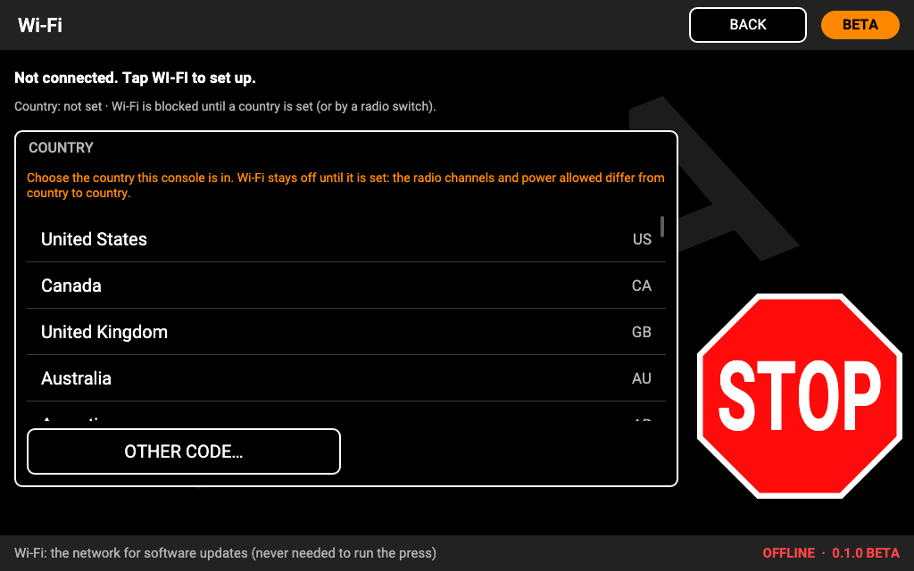
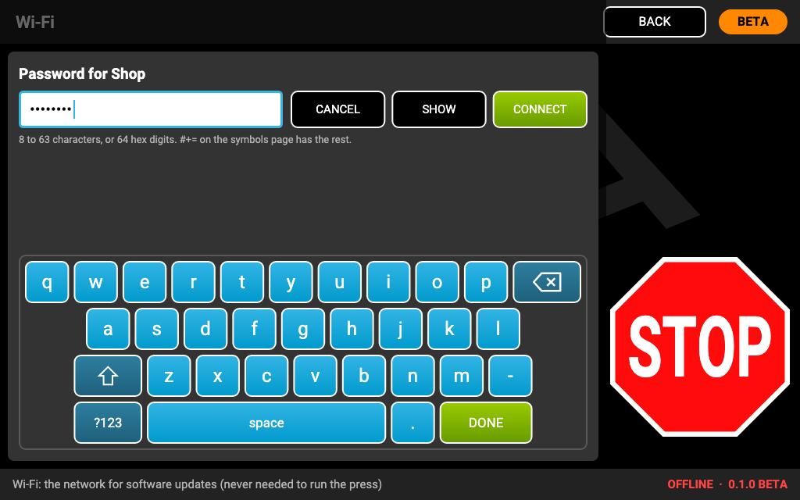
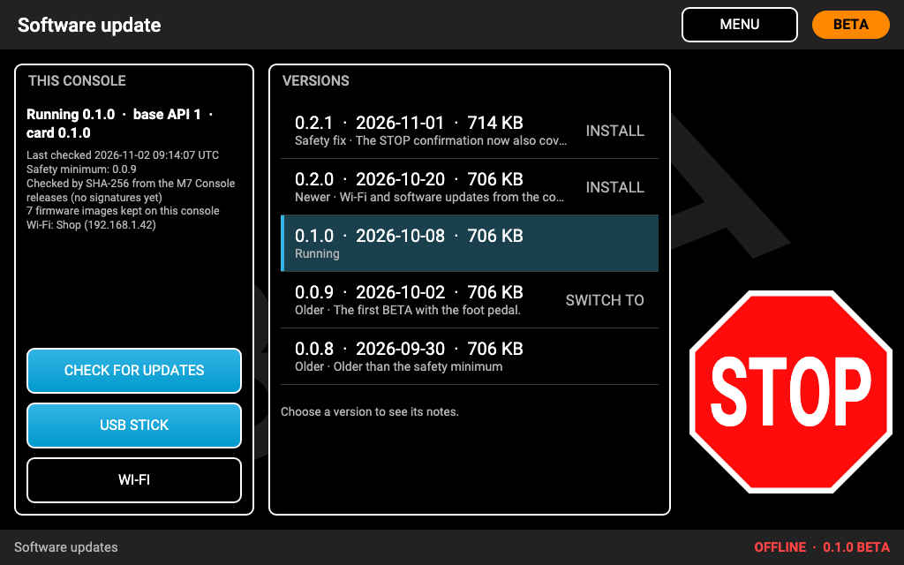
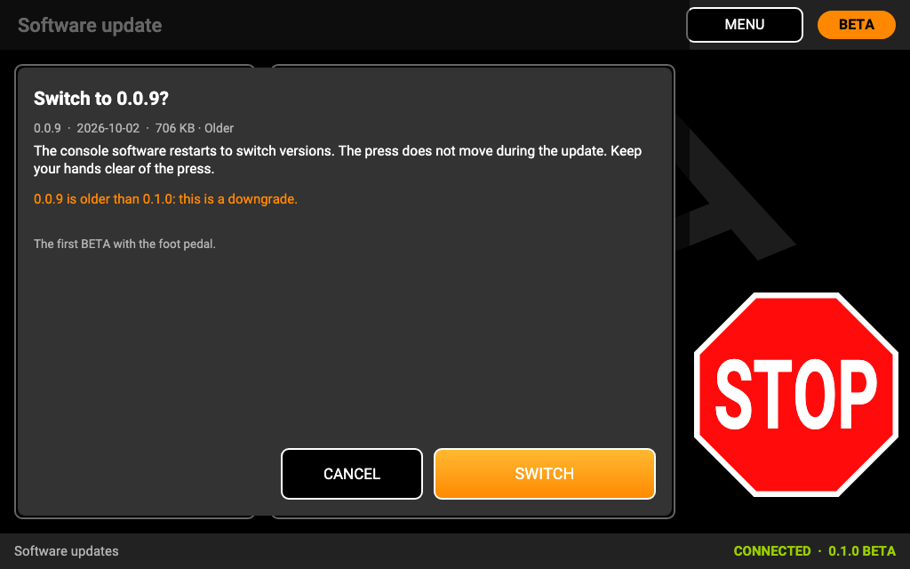
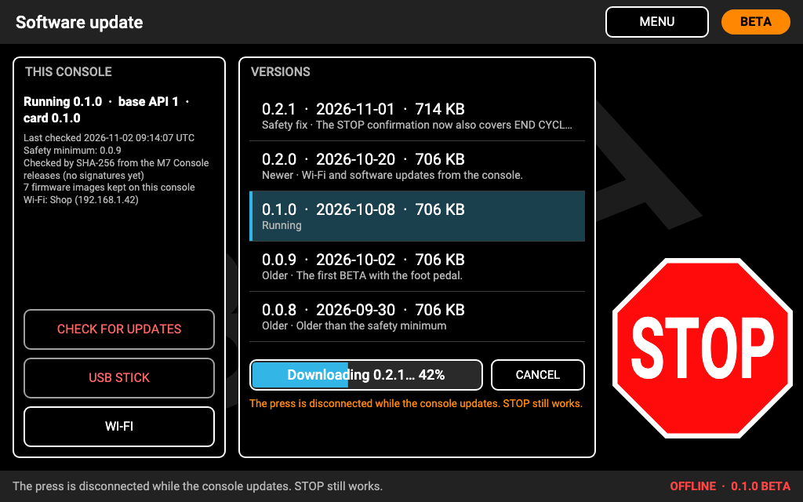
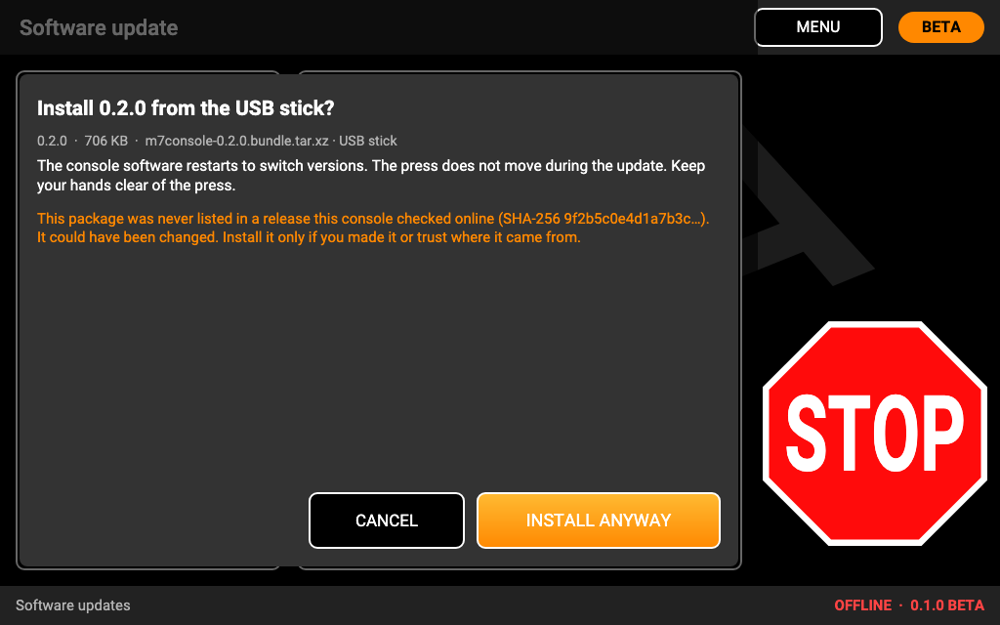

# Software updates and Wi-Fi

M7 Console updates itself from the [M7 Console releases](https://github.com/Shane-Cotta/M7-Console/releases), over
Wi-Fi or Ethernet, or from a USB stick. You can install a newer version (an upgrade) or go back to an older one (a
downgrade). Updates bring the press firmware images with them.

> **Consoles from the first BETA** have no online updates: their SOFTWARE UPDATE page only says to re-write the SD
> card. Update those by writing a newer image to the card ([Installing](install.md)); the new card then has the
> update screens described here. Writing a new card loses the console's saved settings.

## What to know first

- **Nothing is installed unless you tap INSTALL** (or SWITCH TO). The console only checks for updates when you tap
  CHECK FOR UPDATES.
- **Updates are never offered while the press is busy:** while it runs, moves, calibrates, is in die setup, while a
  STOP is being confirmed, while a CRITICAL alert is open or a firmware update runs, and for 5 seconds after.
- **Every install disconnects the press first.** You confirm a "keep your hands clear" question; the console sends
  STOP if anything moves, resets the press controller, and keeps the press disconnected while the update downloads
  and installs. **STOP still works** the whole time. Then the console software restarts into the new version. Tap
  PRESS, ACCEPT and CALIBRATE again afterwards.
- **Updates are checked, not yet signed.** Every package is checked against the SHA-256 checksums published with its
  release, and is downloaded only over HTTPS from the M7 Console releases. They are not yet digitally signed: install
  only from the official releases, or from a USB stick you prepared yourself from them.
- The press never needs Wi-Fi. Wi-Fi is only for updates; the console app itself has no network access.

## Setting up Wi-Fi

Wi-Fi is **off** until you choose the country the console is in (the radio channels and power allowed differ by
country).

1. **SOFTWARE UPDATE → WI-FI** (also in CONSOLE SETTINGS).
2. **Choose your country** from the list, or **OTHER CODE…** to type its two-letter code (for example US).

   

3. **SCAN**, then tap your network. Type its password on the on-screen keyboard (it shows dots; **SHOW** shows the
   text) and tap CONNECT. A network that does not broadcast its name: **HIDDEN NETWORK…**, its name, then its
   security (WPA2, WPA3 or open).

   

4. The status line shows the network and the address once connected.

- Supported: open networks, WPA2 and WPA3 personal (a password). **Not supported:** WPA Enterprise (a user name and
  password) and WEP.
- The password is stored only in the console's network configuration, readable only by the system; it never goes
  into a log.
- **FORGET** removes a saved network and its password.

**Ethernet** works too: plug a cable from your router into the Pi's Ethernet port. The console takes an address from
the router by itself.

## Checking and installing

1. **SOFTWARE UPDATE → CHECK FOR UPDATES.** The console reads the release list (it waits up to about 45 seconds for
   the clock to be set from the network first: the Pi has no clock battery).
2. The **Versions** list shows each version with its date and size, marked **Newer**, **Older**, **Running** or
   **Safety fix**, and **INSTALL** or **SWITCH TO** where it can be installed. Tap a version to read its notes and the
   firmware it brings.
3. Tap **INSTALL**, read the question ("The console software restarts to switch versions. The press does not move
   during the update. Keep your hands clear of the press.") and confirm. A downgrade says so.

   

4. The download shows its progress; **CANCEL** stops it. Then the console checks and installs the version and
   restarts into it.

   

**SWITCH TO** goes to a version that is still on the console without downloading it. The console keeps the running
version, the last version that was confirmed working, and one more.

If an update finishes without restarting the console (for example a switch to the version already running), after
20 seconds the screen offers **USE THE PRESS AGAIN**: the press stays disconnected until you tap it.

## The trial: automatic return to the previous version

A newly installed version is **on trial** ("Trying X.Y.Z. It is kept once the console has run for 15 seconds."). It is
kept once it has run for 15 seconds with its screen working. If it does not start, freezes for 3 minutes, or the
console restarts twice before the version was confirmed, the console **goes back to the previous version by itself**
and says so on the SOFTWARE UPDATE screen. If that happens, please
[report it](https://github.com/Shane-Cotta/M7-Console/issues/new/choose).

## The safety minimum

The release list carries a **safety minimum** ("Safety minimum: X.Y.Z" on the screen). Versions below it are listed
but cannot be installed, because a later version fixed a safety problem in them. The minimum only ever goes up, and
versions withdrawn by a release are never offered. A **Safety fix** badge marks a version that fixes a safety problem:
install it soon.

## From a USB stick (no network)

1. On a computer, download `m7console-X.Y.Z.bundle.tar.xz` from the release you want (and check it against that
   release's `SHA256SUMS.txt`, as in [Installing](install.md#check-the-download)).
2. Copy it, unchanged, to the **top folder** of a FAT or exFAT USB stick, or into a folder named `m7console` on it.
3. Plug the stick into the Pi, open **SOFTWARE UPDATE** and tap **USB STICK**. The stick's packages appear with their
   version.
4. Tap one, and confirm as for an online install.

**A package this console has never seen in an online release list** (because the console has never been online, or
the stick came from somewhere else) shows a warning with the start of its SHA-256: "This package was never listed in
a release this console checked online … It could have been changed. Install it only if you made it or trust where it
came from." It then needs **INSTALL ANYWAY**. Compare the SHA-256 with the release's `SHA256SUMS.txt` before you
tap it. Firmware that comes in such a package never replaces a Mark 7 original on the console.

The console mounts USB sticks **read-only**: it never writes to your stick.

## Firmware images kept

Each version brings the press firmware images of its release. The console keeps **every firmware image it has ever
had**, so going back to an older M7 Console version never takes a newer firmware image away. Updating the console does
not change your press's firmware: that only happens when you flash it on the [FIRMWARE](firmware.md) screen.
