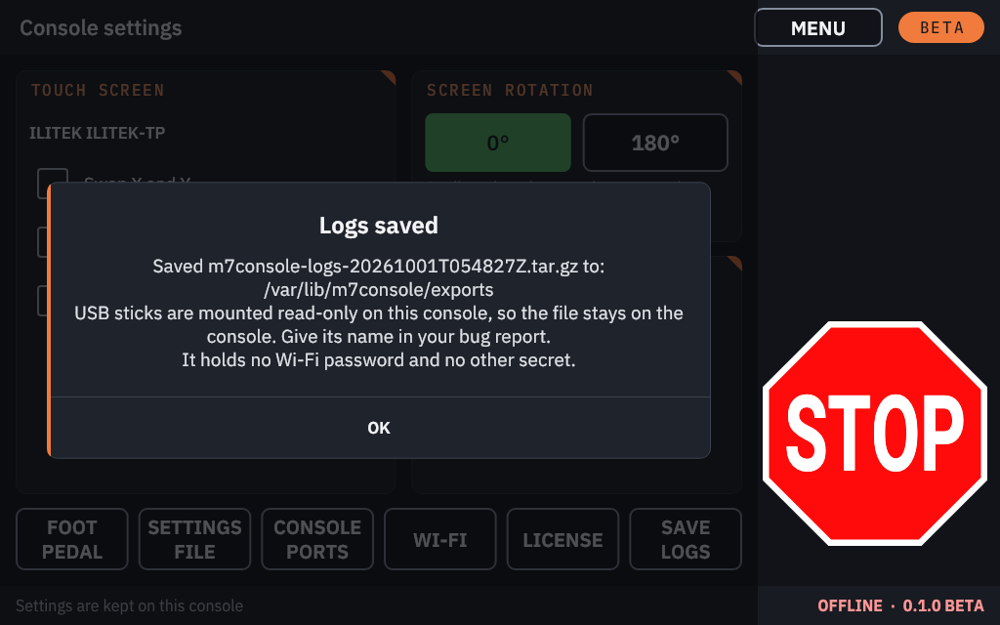

# Troubleshooting

**If the press is moving and anything is not as you expect: switch off the press console's power first**, then read
on.

## No press detected

The status line stays at **Press not connected** or **Connecting to the press…**, or the press screen shows an error
and **CONNECT**.

- Is the press console switched on?
- The cable must go from the press console's **micro-USB port** to a **USB-A port of the Pi**. Not the console's
  USB-A port (that is the motor's).
- Use a **data** cable. Many micro-USB cables sold with chargers carry power only. Try another cable.
- Try another USB port of the Pi, and unplug other USB-serial adapters: connect **one press** only.
- After plugging the cable in, tap **CONNECT** (or MENU, then PRESS) and ACCEPT again.
- **Connection reset** alerts that keep coming back point to a bad cable or a weak power supply.
- "**Identifying the press…**" that never ends, or a fault on the status line: switch the press console off and on,
  then connect again. If the press reports a motor USB or oscillator fault, check the ClearPath motor's USB cable to
  the console and see your press manual.
- A press that shows only the **Settings** tab is running firmware the console does not recognise
  ([STOP-only mode](press-tabs.md#stop-only-mode)).

## Touches land in the wrong place

Use **CONSOLE SETTINGS → Touch screen**: **Swap X and Y**, **Invert X**, **Invert Y**. Each change is on trial for 15
seconds: tap **KEEP** if it is right; if it is wrong, wait and it goes back by itself
([Console settings](console-settings.md#touch-screen)).

- If **nothing** reacts to touch: check the touch USB cable from the screen to the Pi. When the console loses the
  touch panel it shows **TOUCHSCREEN NOT WORKING** (CRITICAL): STOP on the screen cannot work then; use the remote
  stop or the console's power switch.
- Screen upside down: **Screen rotation 180°**, then restart (TURN OFF and on).

## No picture on the screen

- The HDMI cable must be in the Pi's **first HDMI port** (HDMI0, next to the USB-C power input).
- Power the screen from **its own 5 V supply**, and switch it on **before** the Pi.
- Check the Pi's power supply: a red light only, or a Pi that restarts by itself, means too little power.
- The card tells the Pi to drive the screen at 1920x1200 even when the screen does not identify itself at start-up.
  Screens of another resolution are not supported in this BETA.
- If the picture comes only sometimes after a cold start (the screen powered after the Pi), a technician can make the
  console remember the screen's identification: see `PRESS-CONSOLE.txt` on the card's boot partition ("If the screen or
  sound misbehaves").
- If the screen stays black and not even the boot animation appears, the card may be badly written: write it again
  and let Imager verify it, or try another card.

## The screen says "the console app has stopped"

The console app failed to start several times in a row and stopped trying. **The press is not controlled from this
screen: switch the press console off before you touch the press.** Then restart the Pi (unplug and plug in). If it
happens again, write the card again ([Installing](install.md)) and
[report it](https://github.com/Shane-Cotta/khc-press-console/issues/new/choose) with a photo of the screen.

## No sound

- Sound comes through the screen's own speaker over HDMI. A screen without a speaker, or with its volume down, stays
  silent.
- **CONSOLE SETTINGS → Sound** must be **ON**. The panel says which device plays the sounds, or "No sound device
  found: the console is silent".
- The first fraction of a second of a sound can be lost while the screen's audio wakes up.
- Sound also needs the screen's identification at start-up; the same `PRESS-CONSOLE.txt` note as for the picture applies.

Sounds are an extra: every alert also shows on the screen.

## Wi-Fi

- **The Wi-Fi list is empty or Wi-Fi is off:** choose your **country** first (Wi-Fi stays off until it is set), then
  **SCAN**.
- **Your network is not listed:** it may be hidden (use **HIDDEN NETWORK…**), out of range, or a 5 GHz channel not
  allowed in the country you chose.
- **It does not connect:** check the password (**SHOW** shows what you typed). WPA Enterprise and WEP networks are not
  supported.
- **CHECK FOR UPDATES fails** while Wi-Fi is connected: the network may need a sign-in page (hotel or guest Wi-Fi),
  which the console cannot open, or it has no internet. The console also needs the correct time from the internet;
  it waits for it up to about 45 seconds.
- Ethernet to a router works as an alternative.
- A console that cannot reach the internet can still be updated from a [USB stick](software-updates.md#from-a-usb-stick-no-network).

## A firmware update failed

See [Firmware: DO NOT OPERATE](firmware.md#do-not-operate). In short: if nothing was written, the press is unchanged;
if the console shows **DO NOT OPERATE THE PRESS**, flash it again with **FLASH AGAIN**.

## A software update went back by itself

The new version did not start properly, and the console returned to the previous one
([the trial](software-updates.md#the-trial-automatic-return-to-the-previous-version)). The press is fine. Please report
it with the version numbers.

## Reporting a problem

Open an [issue](https://github.com/Shane-Cotta/khc-press-console/issues/new/choose) with the bug report form. Include:

- the console version (bottom right of every screen, or ABOUT);
- the press model and firmware as the console shows them (the status bar on the press screen);
- what you did, what happened, and **the exact text of any alert** (a photo of the screen is best);
- whether the press stopped when it should have. **If it did not, say so in the first line**, and do not use KHC
  Press Console again until the problem is understood;
- the name of the logs file, if you saved one (below).

### Save logs

The console keeps a detailed log of every session on the card, including a record of the last moments before each
CRITICAL alert. **SAVE LOGS** puts it, with the console's version, the press model and firmware and the recent
alerts, into one file:

- **CONSOLE SETTINGS → SAVE LOGS**, at any time; or
- **SAVE LOGS** on the "Save the logs?" message the console shows after you close a CRITICAL alert with CONSOLE IS
  OFF.

It takes a few seconds; the console and STOP keep working meanwhile. It is not possible while a firmware update runs.
When it is done, the console shows the file's name and where it was saved.

- The file is **kept on the console**. USB sticks are mounted read-only on the console, so it cannot be written to a
  stick (the message says so). The console keeps the five newest.
- Give the file's name in your bug report. If the file is needed, the issue will say how to get it off the console's
  SD card (it needs a computer that can read the card's Linux partition, so usually a technician's help).
- The file holds **no Wi-Fi password** and no other secret: the console leaves out its Wi-Fi settings and blanks
  anything in the logs that looks like a password.

## Send a diagnostic report

A technician can send a report straight from the console, with the logs, when it is connected to the internet
(Wi-Fi or Ethernet). They open **DIAGNOSTIC UPLOAD**, type a short description of what happened (and, if you like,
your company and first name), and tap **SEND**. STOP and the RUN column keep working meanwhile.

- **Your description and the diagnostics are posted publicly on GitHub. Your name and company are not.** The console
  says so on the form before you send.
- The logs go with it, privately: only KHC reads them. They hold no Wi-Fi password or network name, no license
  number and no other secret, and errors keep only where they happened, never their messages.
- When it is done, the console shows the ticket number, for example **Ticket KHC-20261002-7F3K sent: GitHub issue
  #42.**, or **Received (ticket …). We'll review it.** on a console in its trial: KHC reads it first and then posts it.
  Give the ticket number if you write to us about it.
- A console can send a few reports a day. If it says there is no internet, connect it (CONSOLE SETTINGS → Wi-Fi) and
  try again.

## For technicians

These need a computer and some Linux experience; operators never need them.

- **`PRESS-CONSOLE.txt`** on the card's boot partition (readable from any computer) describes the card: what runs at
  start-up, the screen and sound settings, and how to enable an administrator login before the first start, from
  which the console's logs can be read.
- **The service link:** a laptop connected to the Pi's Ethernet port with a plain cable gets an address from the
  console (no internet goes through it); the console is then `khc-console.local`. The console has a **read-only
  diagnostic view** for support sessions: it shows the press traffic live on the screen and can stream it to the
  laptop's browser, with a one-time code shown on the console. It never sends anything to the press, it is opened by a
  technician (operators do not need it), and it switches itself off after 30 minutes without use. Nothing listens on
  the network while it is off.
- The console also has a **demo mode for technicians**, opened the same way: the console simulates a press by
  itself, so the screens and the touchscreen can be tried, or the console shown, with no press connected. It is off at every start,
  a large **DEMO — NO PRESS CONNECTED** banner shows on every screen while it is on, and nothing is sent to a press.
- If a number pad titled **Technician: debug and demo mode** appears by accident, tap **CANCEL** (or wait a minute: it
  closes by itself). STOP keeps working while it is open.
